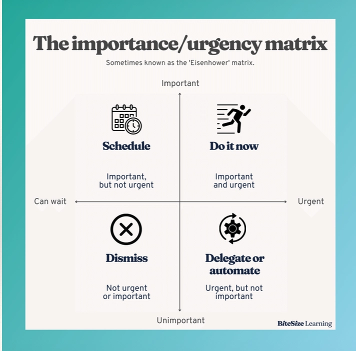
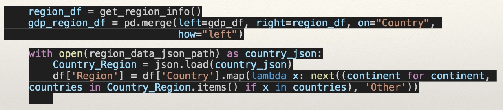
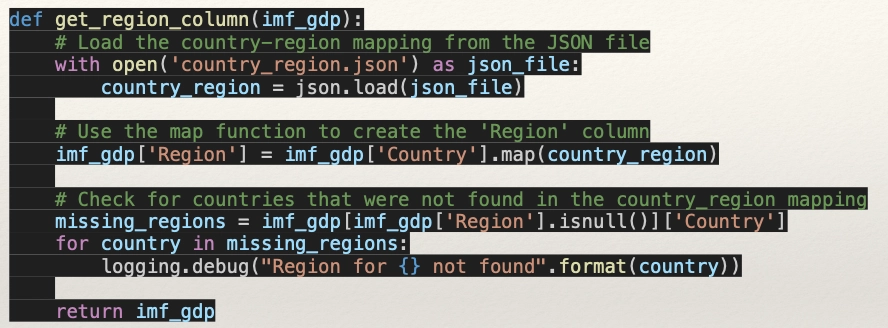
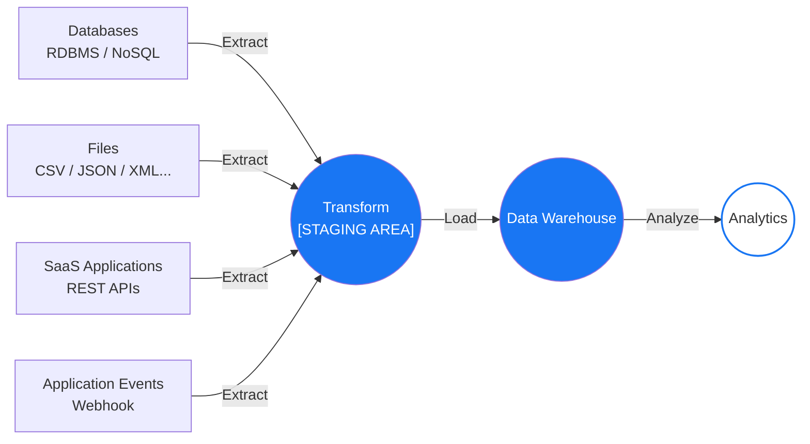
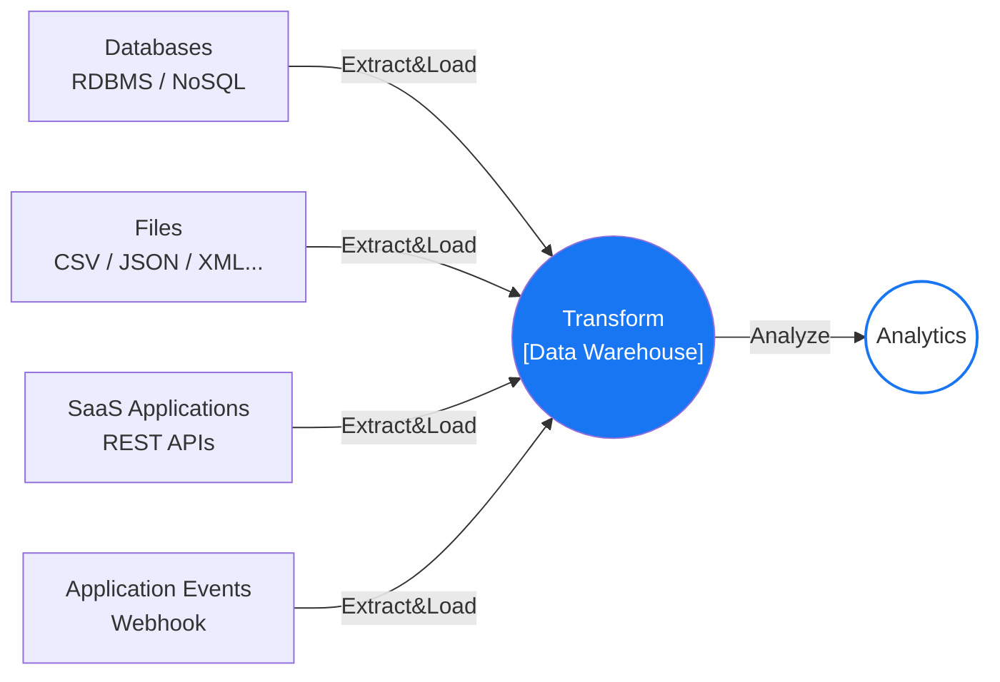
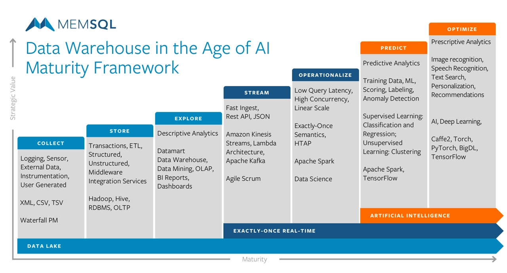
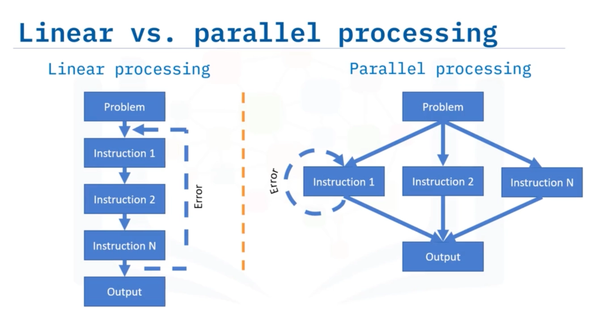
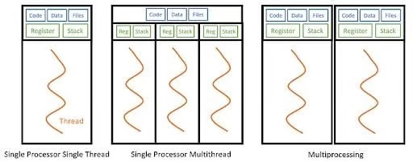
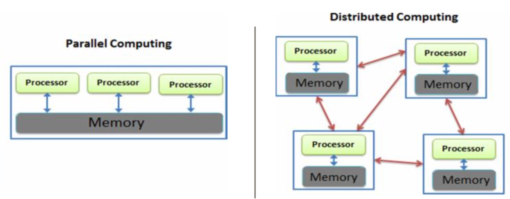

# 목차 
- [목차](#목차)
- [W1 Review](#w1-review)
    - [코드 문제점](#코드-문제점)
  - [ETL PROCESS](#etl-process)
  - [ELT PROCESS](#elt-process)
- [DE : Big Data](#de--big-data)
  - [Big Data](#big-data)
  - [Parallel Processing](#parallel-processing)
    - [Problem decomposition](#problem-decomposition)
      - [Task Parallelism (태스크 병렬성)](#task-parallelism-태스크-병렬성)
      - [Data Parallelism (데이터 병렬성)](#data-parallelism-데이터-병렬성)
    - [Multiprocessing vs. Multithreading (멀티프로세싱 vs. 멀티스레딩)](#multiprocessing-vs-multithreading-멀티프로세싱-vs-멀티스레딩)
    - [Python에서의 Multiprocessing과 Multithreading](#python에서의-multiprocessing과-multithreading)
  - [Distributed Computing](#distributed-computing)
    - [Parallel Computing vs Distributed Computing](#parallel-computing-vs-distributed-computing)
    - [Scaling Up VS Scaling Out](#scaling-up-vs-scaling-out)
    - [Distributed Computing Benefits](#distributed-computing-benefits)
    - [Fault Tolerance (장애 허용성)](#fault-tolerance-장애-허용성)
  - [Cloud Computing](#cloud-computing)
    - [클라우드 컴퓨팅의 주요 장점](#클라우드-컴퓨팅의-주요-장점)
  - [Docker](#docker)
    - [Virtual Machines VS Containers](#virtual-machines-vs-containers)
  - [Data Product](#data-product)
    - [Actionable Data (실행 가능한 데이터)](#actionable-data-실행-가능한-데이터)
      - [Product Development를 잘 하려면](#product-development를-잘-하려면)

<br>
<br>

# W1 Review

- 회고를 잘 하려면 리뷰를 잘 해야 함
    - 리뷰 = 로우 데이터 = 로그
    - 로그를 잘 확인하자
- 회고 = 리뷰한 내용 중 내가 한 행동을 어떻게 다르게 할 것인가?
- 한정된 시간 안에서 어떤 일을 할 수 없다면, 하고 있는 일들의 우선순위가 제대로 설정되어 있는지를 봐야 한다
    
    
    https://www.bitesizelearning.co.uk/resources/urgent-important-matrix-eisenhower
    
- 데이터 파일은 .gitignore로 제외하기
    - 데이터 파일은 주로 다른 곳에 올리고 다운로드 받을 수 있는 링크를 제공함
- 로그가 영어로 쓰여져 있는데 영어가 broken English면 코드 보다가 계속 '잉?'하게 됨
    - grammarly나 chatgpt로 바꾸기
- mtcars 데이터셋은 옛날 데이터. 경제적 가치에 대한 인사이트로 ‘더 연비가 좋은 차를 만들 수 있다’ 같은 것은 무의미함
    - 실제 최신 데이터를 추가로 찾아서 근거를 보충하거나 해야 함
    - **주어진 데이터가 쓰레기거나, 퀄리티가 낮거나, 잘못 해석되진 않았는지 항상 검증해야 함**
    - ‘**구체성**’이 있으면 문장이 간결해짐
- ‘**데이터를 몇 분마다 긁어서 데이터베이스에 반영해야 하나요**’란 질문
    - 컨텍스트(시나리오)에 따라 달라짐
    - 실시간이 중요 OR 배치로 충분
- W1M3 시나리오
    
    > ❖ 당신은 해외로 사업을 확장하고자 하는 기업에서 Data Engineer로 일하고 있습니다. 경영진에서 GDP가 높은 국가들을 대상으로 사업성을 평가하려고 합니다.
    ❖ 이 자료는 앞으로 경영진에서 지속적으로 요구할 것으로 생각되기 때문에 자동화된 스크립트를 만들어야 합니다.
    > 
    - 왜 GDP가 높은 국가들을 대상으로 하는지 물어봤어야 함

### 코드 문제점

- **lambda(), map()** : 많은 데이터를 처리하기 비효율적. 분산 처리하기도 힘듦
    - loop, apply도 마찬가치. pandas를 쓸 수 있아면 pandas 사용
- 빅데이터를 처리한다 =
    - 한 번에 모든 데이터를 처리한다X
    - 쪼갠 단위로 처리해서 점점 더 많은 데이터를 처리한다O
- 캡슐화 안 함



- country_region.json은 conf로 빼서 사용해야 함
- missing 데이터를 로그로 남긴 건 좋음. but 없는 데이터는 nan이나 기본값으로 처리해야 함

<br>

- 코드를 짤 때, 엄청나게 많은 데이터가 병렬로 돌아간다 생각하고 작성해야 함
- Data, Code, config의 분리
    
    ```
    config/
    │   ├── config.yaml
    │   └── settings.py
    ```
    
- ETL code는 반복 사용이 가능해야 함
- ‘저는 되는데요?’ 금지
- parallel processing이 가능한지 고민
- 어떤 컨택스트마다 어떤 방법이 있는지 고민

## ETL PROCESS



- Data Warehouse 비용이 더 비싸다는 전제
- STAGING AREA을 운영, 관리하는 비용 발생

<br>

## ELT PROCESS



- 데이터베이스 성능이 좋아짐

<br>
<br>


# DE : Big Data

## Big Data

Big data is **high-volume(대용량)**, **high-velocity(고속 처리)** and/or **high-variety(다양성) information assets** that demand cost-effective, innovative forms of information processing that enable **enhanced insight**, **decision making**, and **process automation.**


https://www.singlestore.com/blog/memsql-maturity-framework/

<br>
Dark Data

- enterprise data의 80% 이상은 다크 데이터
- 기업이나 조직이 정보 수집을 통해 저장하고 있지만, 실질적인 분석이나 의사 결정에 전혀 활용하지 않고 방치하는 방대한 양의 데이터

<br>

빅데이터는 처리 비용이 비쌈

→ 엄청나게 돈을 많이 벌 수 있는 문제만 해결해야 함

<br>

빅데이터 Lifecycle

- **Business Case** ⇒ Data Collection ⇒ Data Modeling ⇒ Data Processing ⇒ Data Visualization

5Vs of Big Data

- Velocity, Volume, Variety, Veracity, Value

Drivers for Big Data

- Distributed Computing (Parallel Processing)
- Cloud Computing
- Container

<br>

## Parallel Processing

- 모든 하위 문제(sub-problems) 또는 작업(tasks)는 계산을 시작하기 전에 미리 정의된다.
- 각 하위 문제의 결과(sub-solutions)는 서로 독립된 메모리 위치(변수, 배열의 원소 등)에 저장된다.
- 따라서 각 하위 문제의 계산은 서로 완전히 독립적으로 수행될 수 있다.
- 만약 계산 과정에서 시작 또는 종료 시점에만 약간의 통신(communication)이 필요하다면, 이를 '**거의 완전 병렬(nearly embarrassingly parallel)**'이라고 부른다.

<br>
또 다른 명칭으로는 다음과 같은 표현들이 사용된다.

- **Embarrassingly parallelizable**: 매우 쉽게 병렬화할 수 있는
- **Perfectly parallel**: 완벽하게 병렬적인
- **Delightfully parallel**: 아주 이상적으로 병렬화되는
- **Pleasingly parallel**: 만족스럽게 병렬화되는

<br>

### Problem decomposition

#### Task Parallelism (태스크 병렬성)

- **태스크 병렬 모델(Task-parallel model)**은 **프로세스(process)** 또는 **실행 스레드(thread of execution)**에 초점을 맞춘다.
- 이러한 프로세스들은 **서로 다른 역할이나 동작(behavior)**을 수행하는 경우가 많기 때문에, **프로세스 간의 통신(communication)**이 중요하다.
- 따라서 **태스크 병렬성(Task Parallelism)**은 **메시지 전달(Message Passing)** 방식의 통신을 표현하는 데 적합한 모델이다.

#### Data Parallelism (데이터 병렬성)

- **데이터 병렬 모델(Data-parallel model)**은 **데이터 집합(data set)**에 대해 연산을 수행하는 데 초점을 맞춘다.
- 이 데이터 집합은 일반적으로 **규칙적인 구조를 가진 배열(array)** 형태이다.
- 여러 작업(task)이 동일한 연산을 수행하지만, **데이터를 서로 겹치지 않는 부분(disjoint partitions)으로 나누어 독립적으로 처리**한다.
- 데이터가 먼저 있고 코드를 작성

### Multiprocessing vs. Multithreading (멀티프로세싱 vs. 멀티스레딩)


https://builtin.com/data-science/multithreading-multiprocessing

| 멀티스레딩 (Multithreading) | 멀티프로세싱 (Multiprocessing) |
| --- | --- |
| **I/O 작업**에 적합 | **CPU 연산 작업**에 적합 |
| 파일 읽기/쓰기, 네트워크 통신, 데이터베이스 조회 | 이미지 처리, 머신러닝, 대규모 계산, 데이터 분석 |
| 작업이 입출력을 기다리는 동안 다른 스레드가 실행됨 | 여러 CPU 코어를 사용하여 여러 작업을 동시에 계산함 |

<br>

- 각 단계의 작업 특성(I/O-bound 또는 CPU-bound)에 맞는 동시성 모델과 하드웨어를 선택해야 최적의 성능을 얻을 수 있음

| ETL 단계 | 작업 특성 | 적합한 동시성 모델 | 중요한 하드웨어 |
| --- | --- | --- | --- |
| **Extract** | I/O-bound (상황에 따라) | 멀티스레딩, Async | 네트워크, DB 연결, 메모리 |
| **Transform** | CPU-bound (상황에 따라) | 멀티프로세싱, 벡터화, 분산 처리 | CPU 코어 수, 메모리 |

<br>
- shuffle 이란 게 생기면 심각하게 성능이 떨어짐
- Transform 단계에서 실시간 API를 쓰는 건 위험할 수 있음
    - ex) 8백만 건 파운드 데이터를 USD로 바꾸는 과정이 1시간 걸릴 때, 처리 환율 기준은?

<br>

### Python에서의 Multiprocessing과 Multithreading

| Multiprocessing | Multithreading |
| --- | --- |
| 작업마다 **새로운 프로세스** 생성 | 하나의 프로세스 안에서 **여러 스레드** 생성 |
| 여러 CPU 코어를 모두 활용 가능 | GIL(Global Interpreter Lock) 때문에 동시에 하나의 스레드만 Python 코드 실행 가능 |
| **CPU-bound 작업**에 적합 | **I/O-bound 작업**에 적합
| 예: 이미지 처리, 대규모 계산 | 예: 파일 읽기, 웹 요청, 데이터베이스 조회 |

<br>

## Distributed Computing

### Parallel Computing vs Distributed Computing




### Scaling Up VS Scaling Out

- Scaling Up
    - 장비의 성능을 향상시키기 위해 기존 장비를 업그레이드하는 방식
    - 예: CPU, 메모리(RAM), 저장장치 등을 더 높은 성능의 것으로 교체하거나 추가하는 것
- Scaling Out
    - **새로운 장비를 추가하고, 작업(워크로드)을 여러 장비에 분산하여 처리하는 방식**
    - 예: 서버를 여러 대 추가하여 요청이나 데이터를 나누어 처리하는 것

### Distributed Computing Benefits

- 확장성(Scalability)과 모듈식 성장(Modular Growth)
    - 필요하면 서버를 쉽게 추가해서 시스템을 키울 수 있다.
- 장애 허용성(Fault Tolerance)과 중복성(Redundancy)
    - 서버 하나가 고장 나도 다른 서버가 대신 동작해서 서비스가 중단되지 않는다.


### Fault Tolerance (장애 허용성)

: 시스템의 일부에 **장애(Fault)**가 발생하더라도 **전체 시스템이 계속 정상적으로 동작할 수 있는 능력**

- **High Availability (고가용성) vs. Fault Tolerance (장애 허용성)**
    - High Availability(고가용성) : 시스템이 가능한 한 중단 없이 계속 서비스를 제공하는 것을 목표(Goal, Value)
    - Fault Tolerance(장애 허용성) : 고가용성을 달성하기 위한 수단(Means)
- **Redundancy (중복성)**
    - 동일한 기능을 수행하는 예비 장비나 시스템을 여러 개 준비해 두는 것
- **SPOF (Single Point of Failure, 단일 장애 지점)**
    - 하나의 구성 요소가 고장 나면 전체 시스템이 멈추게 되는 지점
    - 시스템 설계에서는 SPOF를 제거하거나 최소화하는 것이 중요
- **Disaster Recovery (재해 복구)**
    - 화재, 정전, 자연재해, 대규모 장애 등 심각한 사고(Disaster)가 발생한 후 시스템과 데이터를 복구하여 서비스를 재개하는 과정
    - 일반적으로 데이터 백업, 복제(Replication), 예비 서버, 다른 지역의 데이터센터 등을 활용하여 빠르게 서비스를 복구

## Cloud Computing

: 인터넷을 통해 필요한 IT 자원을 원하는 시점에 제공받고, 사용한 만큼만 비용을 지불하는(Pay-as-you-go) 서비스 방식

- 사용자는 **물리적인 데이터센터나 서버를 직접 구매, 소유, 유지·관리할 필요 없이**, 필요에 따라 인터넷을 통해 다양한 기술 서비스를 이용할 수 있음
- 이러한 서비스에는 다음과 같은 IT 자원 포함
    - **컴퓨팅 성능(Computing Power)**: 가상 서버, CPU 등
    - **스토리지(Storage)**: 데이터 저장 공간
    - **데이터베이스(Database)**: 데이터 관리 서비스
- Amazon Web Services (AWS)

### 클라우드 컴퓨팅의 주요 장점

- **Agility (민첩성)**
    - : 필요한 IT 자원을 빠르게 구축하고 변경하며 배포할 수 있는 능력
    - **Time-to-market (시장 출시 시간)  단축**
        - 새로운 제품이나 서비스를 시장에 출시하기까지 걸리는 시간
- **Elasticity (탄력성)**
    - 사용량에 따라 컴퓨팅 자원을 자동 또는 필요에 따라 늘리거나 줄일 수 있는 능력
    - 사용량이 많을 때는 자원을 늘리고, 적을 때는 줄여 비용과 성능을 최적화
    - **Scale Up / Down (수직 확장 / 축소)**
        - **Scale Up**: 기존 서버의 CPU, 메모리 등 성능을 높이는 것
        - **Scale Down**: 필요가 줄어들면 기존 서버의 자원(CPU, 메모리 등)을 줄이는 것
    - **Scale Out (수평 확장)**
        - 서버를 추가하여 작업을 여러 서버에 분산 처리하는 방식
        - 사용자 수나 데이터가 증가해도 서버를 추가하여 처리 성능을 높일 수 있음
- **Cost Savings (비용 절감)**
    - 필요한 자원만 사용하고 사용한 만큼만 비용을 지불(Pay-as-you-go)하기 때문에 초기 투자 비용과 운영 비용을 절감
    - 서버 구매 및 유지보수 비용도 절감
- **Deploy Globally in Minutes (몇 분 만에 전 세계에 배포)**
    - 클라우드 서비스를 이용하면 전 세계 여러 지역(Region)에 몇 분 만에 서비스를 배포 가능

<br>

## Docker

“Build once, Run anywhere.”

### Virtual Machines VS Containers

- **Virtual Machines**
    - Virtualization of the OS Kernerl + Applications layer
    - OS 2종류 : Host OS , Guest OS
    - Hypervisor
- **Containers**
    - Virtualization of Applications layer only
    - OS 하나
    - Hypervisor 대신 Docker Engine

| 가상머신(VM) | 컨테이너(Container) |
| --- | --- |
| 운영체제를 각각 포함 | 호스트 운영체제를 공유 |
| OS 라이선스가 필요할 수 있음 | 별도 OS 라이선스가 거의 필요 없음 |
| OS 오버헤드가 큼 | OS 오버헤드가 작음 |
| 무겁고 자원 사용량이 큼 | 가볍고 작은 Footprint |
| 부팅 시간이 김 | 실행 및 시작 속도가 빠름 |

<br>

## Data Product

- **재사용 가능한 데이터 자산(reusable data asset)**
- 이는 데이터 자체뿐만 아니라, 권한이 있는 사용자(Authorized Consumers)가 데이터를 독립적으로 활용하는 데 필요한 모든 요소를 함께 포함한 형태

.png?width=1350&height=654&name=Untitled-1%20(1).png)

### Actionable Data (실행 가능한 데이터)

- **즉시 행동으로 옮길 수 있는 정보** 또는 **의사결정자가 앞으로 어떤 조치를 취해야 하는지 명확하게 판단할 수 있도록 충분한 통찰(Insight)을 제공하는 정보**


#### Product Development를 잘 하려면

- Use Case를 아주 구체적으로
    - 고통이 아주 큰 문제를 정의
    - 고통이 큰 문제를 푸는 Use Case를 아주 구체적으로 작성
- 주제를 좁혀서
    - 현대 자동차의 차 → Ionic5
- 고객을 좁혀서
    - 현대 자동차 → 현대자동차 인사팀
- 비싸게 돈을 받고 서비스를 판다고 가정. 살까? 그 정도의 가치가 있을까?

---

multiprocessing 모듈은 각각 다른 메모리 공간을 사용하는 여러 프로세스를 만들어서 완전히 독립적으로 동시 작업을 할 수 있다. 단, CPU 코어가 여러 개 있는 컴퓨터에서만 제대로 효과를 볼 수 있다.