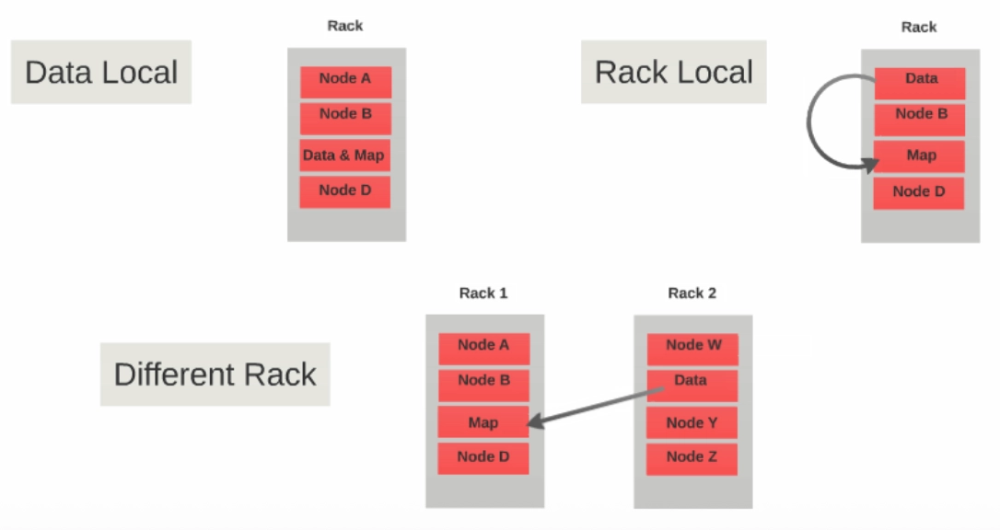
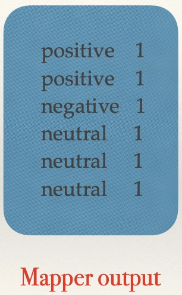
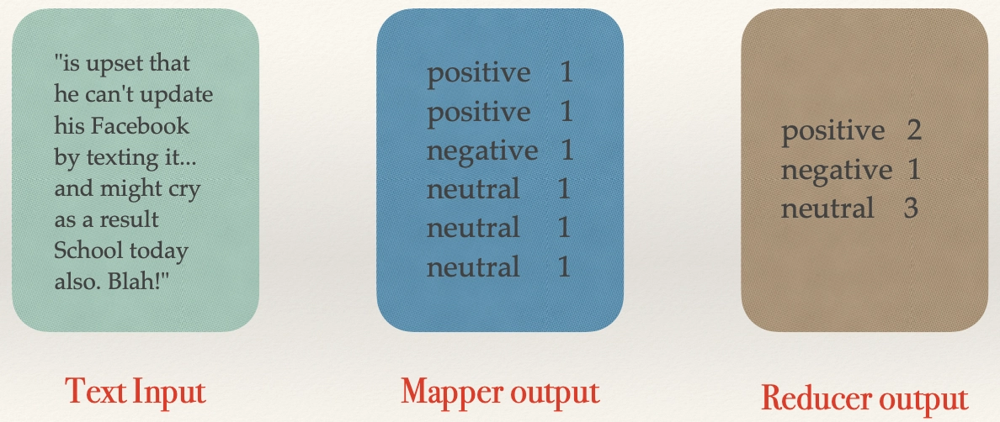

# 목차
- [목차](#목차)
- [DE : Apache Hadoop](#de--apache-hadoop)
  - [Hadoop의 기원](#hadoop의-기원)
    - [왜 Hadoop의 기원을 이해해야 할까?](#왜-hadoop의-기원을-이해해야-할까)
    - [2000년대 초반의 시대적 배경](#2000년대-초반의-시대적-배경)
    - [Hadoop은 어떤 문제를 해결하기 위해 등장했는가?](#hadoop은-어떤-문제를-해결하기-위해-등장했는가)
  - [Hadoop Architecture](#hadoop-architecture)
    - [4 Modules of Hadoop](#4-modules-of-hadoop)
    - [Hadoop Components](#hadoop-components)
    - [Hadoop Architecture](#hadoop-architecture-1)
  - [HDFS (Hadoop Distributed File System)](#hdfs-hadoop-distributed-file-system)
    - [Assumptions and Goals of HDFS](#assumptions-and-goals-of-hdfs)
    - [Simple Coherency Model](#simple-coherency-model)
    - [Commodity Hardware](#commodity-hardware)
    - [HDFS Architecture](#hdfs-architecture)
    - [NameNode \& DataNode](#namenode--datanode)
    - [Data Replication](#data-replication)
    - [Data Locality](#data-locality)
  - [YARN](#yarn)
    - [Yet Another Resource Manager (YARN)](#yet-another-resource-manager-yarn)
    - [ResourceManager, NodeManager, ApplicationMaster](#resourcemanager-nodemanager-applicationmaster)
    - [ResourceManager의 Scheduler](#resourcemanager의-scheduler)
    - [ResourceManager의 ApplicationsManager](#resourcemanager의-applicationsmanager)
    - [ApplicationMaster](#applicationmaster)
  - [MapReduce](#mapreduce)
    - [Hadoop MapReduce](#hadoop-mapreduce)
    - [Map Phase](#map-phase)
      - [a. RecordReader](#a-recordreader)
      - [b. Map](#b-map)
      - [c. Combiner](#c-combiner)
      - [d. Partitioner](#d-partitioner)
    - [Reduce Phase](#reduce-phase)
      - [a. Sort \& Shuffle](#a-sort--shuffle)
      - [b. Reduce](#b-reduce)
      - [c. OutputFormat](#c-outputformat)
    - [MapReduce에서 사용되는 데이터 저장소](#mapreduce에서-사용되는-데이터-저장소)
      - [Local Disk 사용](#local-disk-사용)
      - [Intermediate Data](#intermediate-data)
      - [Shuffle \& Sort 단계](#shuffle--sort-단계)
      - [Reduce 단계](#reduce-단계)
    - [Running a MapReduce Job](#running-a-mapreduce-job)
    - [Mapper.py](#mapperpy)
    - [Reducer.py](#reducerpy)

<br>
<br>


# DE : Apache Hadoop

>
> - 잘 모르는 분야는 Timeboxing
> - 오늘 하둡, 다음주에 스파크
>     - 기본적으로 옛날 버전으로 가르침
> - 멀리 보려면 거인의 어깨 옆에서 봐라
>     - 툴을 만든 사람 등 사람들의 고민과 선택의 이해가 중요함

## Hadoop의 기원

### 왜 Hadoop의 기원을 이해해야 할까?

→ “To truly grasp Hadoop, we must first understand the world it was born into.”

→ "Hadoop을 진정으로 이해하려면, 먼저 Hadoop이 탄생한 세상을 이해해야 한다."

<br>

### 2000년대 초반의 시대적 배경

- **웹 데이터의 폭발적인 증가**
    - Google, Yahoo, Facebook은 방대한 양의 비정형 데이터(예: crawl logs, clickstreams, social posts)를 색인화하고 저장하며 분석하고 있었다.
- **기술 환경**
    - No Cloud : 모든 시스템은 온프레미스(On-Premises) 환경에서 운영됨
    - 서버는 저렴한 범용 하드웨어(Commodity Hardware)였지만 신뢰성이 낮았다.
    - 기존의 데이터베이스는 페타바이트(PB) 규모까지 수평 확장하는 것이 불가능했다.
- **Google의 논문에서 영감을 받음**
    - Google File System(2003) → HDFS
    - MapReduce(2004) → Hadoop MapReduce

<br>

### Hadoop은 어떤 문제를 해결하기 위해 등장했는가?

: 저렴한 하드웨어(Commodity Hardware)와 병렬 처리를 활용하여 huge datasets(PB 이상)를 안정적으로 저장하고 처리하는 것.

<br>

## Hadoop Architecture

### 4 Modules of Hadoop

- **Hadoop Common**
    - 다른 Hadoop 모듈들을 지원하는 공통 유틸리티 모음
- **HDFS**
    - 애플리케이션 데이터에 대한 고속 접근을 제공하는 분산 파일 시스템
- **Hadoop Yarn**
    - 리소스(자원) 매니저 역할
    - 작업(Job) 스케줄링과 클러스터 자원 관리를 위한 프레임워크
- **Hadoop MapReduce**
    - YARN 기반으로 대용량 데이터를 병렬 처리하는 시스템

<br>

### Hadoop Components

각 계층은 독립적.

- Storage Layer  - HDFS
- Resource Management Layer - Hadoop Yarn
- Application Layer - Hadoop MapReduce

<br>


<br>

### Hadoop Architecture


- ResourceManager, NodeManager, ApplicationMaster가 Yarn
- Hadoop은 **Data Parallelism(데이터 병렬성)을 사용하는 시스템**
    - **Data Parallelism**: 데이터를 여러 조각으로 나누고, 데이터가 저장된 노드에서 병렬로 처리하여 네트워크 비용을 줄이고 처리 속도를 높이는 방식 ("Move computation to data")

<br>

## HDFS (Hadoop Distributed File System)

### Assumptions and Goals of HDFS

- Hardware Failure
    - 부품 하나가 언제나 죽을 수 있다고 생각 → Replication
- Streaming Data Access
    - 파일을 조금씩 순차적으로 읽는 방식(Streaming)에 최적화
- Large Data Sets
- **Simple Coherency Model(단순 일관성 모델)**
    - 파일의 일관성을 단순한 규칙으로 보장하는 방식
        - 수정 불가, 순차적 읽기만 가능, 수정하려면 새 파일로 생성, 한 파일에 동시에 여러명이 쓰기 금지
    - 대용량 데이터를 여러 서버에 분산 저장하는 환경에서는 여러 사용자가 동시에 파일을 수정하면 동기화와 충돌 해결이 매우 복잡 해짐
        - 이러한 문제를 해결하기 위해 **Write Once, Read Many(WORM) 모델**을 채택
        - 안 바뀌는 데이터 : **로그** 데이터
- **“Moving Computation (계산) is Cheaper than Moving Data”**
    - 데이터를 계산 서버로 가져오는 대신, 계산(프로그램)을 데이터가 저장된 서버로 보내 처리함
    - 코드가 작아야 하고, 저렴한 곳에서도 돌아가야 함
- Portability Across Heterogeneous Hardware and Software Platforms
    - 특정 운영체제나 특정 서버에 종속되지 않고 다양한 환경에서 동일하게 동작하도록

<br>

로그데이터 저장 문제를 해결하기 위한 도구임. RDB에 저장해야 할 데이터를 하둡에 저장하면 안 됨

하둡에 뭘 저장하려 하면 하둡의 목적에 맞는 데이터인지 판단해야 함

<br>

### Simple Coherency Model

- HDFS 애플리케이션은 **WORM(Write Once, Read Many, 한 번 쓰고 여러 번 읽기)** 접근 방식을 사용한다. 즉, 파일은 한 번 생성되어 작성되고 닫히면 이후에는 변경하지 않는다.
- 이러한 가정은 **데이터 일관성(Coherency) 문제를 단순화**하고, **높은 처리량(High Throughput)의 데이터 접근**을 가능하게 한다.
- **MapReduce 애플리케이션**이나 **웹 크롤러(Web Crawler)**와 같은 작업은 이러한 모델에 매우 적합하다.
- 향후에는 **파일에 데이터를 이어서 추가(Appending Writes)**하는 기능을 지원할 계획이 있다.

<br>


- Secondary Name Node : Name Node가 죽을까봐
- 서로 추상화 되어있음.

<br>

### Commodity Hardware


- Name Node는 좋은 하드웨어 쓰는 경우 많음

<br>

### HDFS Architecture


- 같은 Rack 내에서는 빠르고 Rack 간에는 상대적으로 느림

<br>

### NameNode & DataNode

- **NameNode**는 파일 시스템의 **메타데이터(Metadata)**를 저장한다. 여기에는 파일 이름, 파일을 구성하는 블록 정보, 블록의 저장 위치, 접근 권한 등이 포함된다. 또한 **DataNode를 관리**하는 역할을 수행한다.
- **DataNode**는 실제 데이터를 저장하는 **슬레이브(Slave) 노드**이다. NameNode의 지시에 따라 클라이언트의 **읽기(Read) 및 쓰기(Write) 요청**을 처리한다.
- **DataNode는 파일의 실제 데이터 블록(Block)**을 저장하며, **NameNode는 블록의 위치, 접근 권한 등의 메타데이터**를 저장한다.

<br>

### Data Replication


NameNode는 메터 데이터만 오고 감

<br>

### Data Locality

제일 중요한 내용 중에 하나

데이터가 있는 곳에서 계산을 수행(Move computation to data)하는 원칙



**Data Local**
- 데이터와 연산(Task)이 같은 노드(Node)에서 실행
- 네트워크를 사용하지 않아 가장 빠름
- 가장 우선적으로 선택하는 방식

**Rack Local**
- data는 node A에 있는데 코드를 node C에 있음
- 일반적으로 데이터가 있는 노드에서 실행할 수 없을 때(자원이 부족하거나 이미 다른 작업 수행 중) 선택됨
- 같은 Rack에 있어서 빠름

**Different Rack**
- Rack2의 모든 노드 전체가 코드를 돌릴 상황이 안 되는 경우
- Rack1의 Node C가 Rack2의 node 2에서 데이터 불러움
- Rack 간 네트워크를 통해 데이터를 가져와야 하므로 가장 느림

<br>

!!! data가 움직이는 비용이 제일 비싸다. 어떻게든 데이터를 안 옮기고 처리할 수 있는 방법을 찾아야 한다

- 데이터가 움직인다 = 네트워크를 탄다

<br>

## YARN

### Yet Another Resource Manager (YARN)

- **YARN의 핵심 아이디어**는 **자원 관리(Resource Management)**와 **작업 스케줄링 및 모니터링(Job Scheduling/Monitoring)** 기능을 서로 분리하는 것이다.
- 이를 위해 **클러스터 전체를 관리하는 ResourceManager(RM)**와 **애플리케이션마다 하나씩 존재하는 ApplicationMaster(AM)**를 둔다.
- 여기서 **애플리케이션(Application)**은 하나의 작업(Job)이거나, 여러 작업이 **DAG(Directed Acyclic Graph, 방향성 비순환 그래프)** 형태로 연결된 작업 집합을 의미한다.

<br>

!image.png

- Client
    - 사용자가 MapReduce 작업(Job)을 제출하는 곳
    - 작업 실행 요청을 **ResourceManager(RM)**에게 보낸다.
    - 작업 진행 상황(Status)도 확인할 수 있다.
- **ResourceManager (RM) :** 클러스터 전체의 자원(CPU, 메모리)을 관리하는 관리자
    - Job을 처음 접수
    - 어떤 노드에 자원을 할당할지 결정
    - ApplicationMaster를 실행할 Container를 할당
    - NodeManager들의 자원 상태를 관리
- **NodeManager (NM) :** 각 노드(Node)를 관리하는 관리자
    - ResourceManager에게 현재 노드 상태 보고
    - Container 실행
    - Container 종료
    - CPU/메모리 사용량 관리
- **Container :** 실제 프로그램이 실행되는 공간
- **ApplicationMaster (AM) :** 하나의 Job을 전담 관리하는 관리자
    - 필요한 Container 요청
    - Map Task 실행
    - Reduce Task 실행
    - 실패한 Task 재실행
    - 진행상황 관리

<br>

### ResourceManager, NodeManager, ApplicationMaster

- **ResourceManager**와 **NodeManager**는 함께 **데이터 처리(Data-Computation) 프레임워크**를 구성한다.
- **ResourceManager(RM)**는 시스템 내의 모든 애플리케이션에 대해 **자원을 할당하고 조정하는 최종 관리자**이다.
- **NodeManager(NM)**는 **각 노드(서버)에서 실행되는 에이전트**로, **Container를 관리**하고 CPU, 메모리, 디스크, 네트워크 등의 **자원 사용량을 모니터링**하여 ResourceManager(또는 Scheduler)에 보고한다.
- **ApplicationMaster(AM)**는 **애플리케이션마다 하나씩 생성**되며, ResourceManager와 **필요한 자원을 협상(요청)**하고, NodeManager와 협력하여 **작업(Task)의 실행과 모니터링**을 담당한다.

<br>


1. YARN 클라이언트가 제출하는 Job/Application (MapReduce, java application 등등) 이
ResourceManager 에게 제출이 된다.
2. 마스터 노드의 Application Manager는 제출된 job의 유효성을 체크하고, 자원 할당을 위해
Scheduler에게 넘겨준다.
3. Scheduler는 임의의 slave node에 있는 컨테이너 중 하나를 Application Master로 할당한다.
- Application Manager와 Application Master는 다른 애임

<br>

### ResourceManager의 Scheduler

- **Scheduler**는 **클러스터에서 실행 중인 여러 애플리케이션에 자원을 할당**하는 역할을 한다. 이때 **클러스터 용량(Capacity), 큐(Queue) 등의 제약 조건**을 고려하여 자원을 배분한다.
- Scheduler는 **순수한 스케줄러(Pure Scheduler)**로서, **애플리케이션의 실행 상태를 추적하거나 모니터링하지 않는다.** 또한 애플리케이션 오류나 하드웨어 장애로 인해 **실패한 작업(Task)을 재시작하는 기능도 제공하지 않는다.**
- Scheduler는 각 애플리케이션이 요청한 **자원 요구사항(Resource Requirements)**을 바탕으로 스케줄링을 수행한다. 이때 자원은 **Container**라는 추상적인 단위로 관리되며, Container에는 **메모리, CPU, 디스크, 네트워크** 등의 자원이 포함된다.

<br>

### ResourceManager의 ApplicationsManager

- **ApplicationsManager**는 다음과 같은 역할을 담당한다.
    1. **사용자로부터 작업(Job) 제출을 받아들인다.**
    2. **애플리케이션별 ApplicationMaster를 실행하기 위한 첫 번째 Container를 ResourceManager와 협의하여 할당한다.**
    3. **ApplicationMaster가 실패했을 경우, 해당 Container를 재시작하는 서비스를 제공한다.**

<br>

### ApplicationMaster

- **ApplicationMaster(AM)**는 **애플리케이션마다 하나씩 생성**되며, 다음과 같은 역할을 담당한다.
    1. **Scheduler와 협상하여 필요한 Resource Container를 할당받는다.**
    2. **할당된 Container의 상태(Status)를 추적한다.**
    3. **작업(Task)의 실행 진행 상황(Progress)을 모니터링하고 관리한다.**


1. Application Master는 slave nodes상의 데이터의 위치, cpu, memory등을 Resource Manager
에 제공함으로써 Application Master 외의 container들을 조율한다.
2. Resource Manager는 최상의 리소스들을 할당하고, Application master에 node의 디테일한
정보들을 전달한다.
3. Application master는 container들을 실행시키기 위해 제안된 slave node상의 Node manager
에게 요청을 보낸다.
4. Application master는 잡이 실행되는 동안, 요청된 container들의 리소스를 관리한다. 그리
고 실행이 완료되면, Resource manager에게 알려준다.
5. Node manager는 Scheduler가 새로운 application을 시작할 수 있도록 하기 위해, 주기적으
로 자신의 노드에서 현재 이용가능한 리소스들의 상태를 Resource manager에게 알려준다.
6. Slave node에서 이상이 생긴 경우, Resource manager는 Application master가 프로세스를
완료할 수 있도록 새로운 container를 할당한다.

<br>

추가 학습
https://data-flair.training/blogs/hadoop-yarn-resource-manager/

<br>

## MapReduce

### Hadoop MapReduce

- **Hadoop MapReduce**는 **대규모 데이터(수 TB 규모)를 저렴한 범용 하드웨어(Commodity Hardware)로 구성된 large clusters(수천 대의 노드)**에서 **병렬 처리**할 수 있도록 지원하는 소프트웨어 프레임워크이다. 또한 **높은 신뢰성(Reliability)**과 **장애 허용(Fault Tolerance)**을 제공한다.

<br>

- MapReduce 작업(Job)은 일반적으로 **입력 데이터를 여러 개의 독립적인 청크(Chunk)**로 분할하고, 이를 **Map Task**가 병렬로 처리한다. 
이후 프레임워크가 **Map의 출력 결과를 정렬(Sort)**하여 **Reduce Task**의 입력으로 전달한다. 일반적으로 작업의 입력과 출력은 **HDFS**에 저장되며, 프레임워크(YARN)가 **작업 스케줄링, 모니터링, 실패한 작업의 재실행**을 담당한다.
- 일반적으로 **연산 노드(Compute Node)**와 **저장 노드(Storage Node)**는 동일한 서버이다. 
즉, **MapReduce와 HDFS가 같은 노드에서 실행**된다. 
이를 통해 **데이터가 저장된 노드에서 작업을 수행(Data Locality)**하여 네트워크 비용을 줄이고 높은 처리 성능을 얻을 수 있다.
- **MapReduce 프레임워크**는 **하나의 ResourceManager**, **각 노드마다 하나의 NodeManager**, 그리고 **애플리케이션마다 하나의 MRAppMaster(ApplicationMaster)**로 구성된다.
- MapReduce 애플리케이션을 작성하려면 최소한 다음 사항을 지정해야 한다.
    1. **입력(Input)과 출력(Output)의 위치**
    2. **Map 함수와 Reduce 함수의 구현**
    
    이러한 설정과 기타 작업(Job) 관련 매개변수들이 **Job Configuration**을 구성한다.
    

<br>


- map, reduce 코드 2개
- map이 끝난 데이터는 로컬에 저장
- 로컬에서 읽고 병합해서 reduce한 데이터를 HDFS에 저장

<br>

### Map Phase

#### a. RecordReader

- Hadoop은 MapReduce 작업의 입력 데이터를 **Input Split(Split)**이라는 **고정 크기의 단위**로 나눈다.
- **RecordReader**는 이러한 Split을 **레코드(Record)** 단위로 변환하고, **Key-Value 형태**로 Mapper에 전달한다.
- 단, RecordReader는 **레코드 자체의 내용을 해석(Parsing)하지는 않는다.**

#### b. Map

- **Map 단계**에서는 각 **Input Split마다 하나의 Map Task**가 생성되며, 사용자가 정의한 **Map 함수(Map Function)**를 실행한다.
- Map 함수는 입력 레코드를 처리하여 **0개 이상의 중간(Key-Value) 데이터**를 생성한다.
- Map Task의 출력은 **로컬 디스크(Local Disk)**에 저장되며, 이후 **Reduce Task**의 입력으로 사용된다.
- 작업(Job)이 완료되면 이 **중간 출력 데이터(Intermediate Output)**는 삭제된다.

#### c. Combiner

- **Combiner**는 **Map 단계에서 생성된 중간 결과를 미리 집계(Local Aggregation)**하는 기능이다.
- Map 함수의 출력 데이터를 **Reducer로 전달하기 전에 동일한 Key끼리 결합**하여 데이터의 양을 줄인다.
- 이를 통해 네트워크로 전송되는 데이터(Shuffle 데이터)의 양을 감소시켜 성능을 향상시킨다.
- **Combiner는 선택 사항(Optional)**이며, 모든 MapReduce 작업에서 반드시 실행되는 것은 아니다.

#### d. Partitioner

- **Reducer가 여러 개**인 경우, Map Task는 자신의 출력 데이터를 **Reducer의 개수만큼 Partition**으로 나눈다.
- **같은 Key를 가진 데이터는 반드시 동일한 Partition**에 저장되며, 결국 **같은 Reducer**에서 처리된다.
- 기본적으로 Hadoop은 **Hash 함수를 사용하는 기본 Partitioner(Hash Partitioner)**를 제공하지만, 사용자가 **사용자 정의 Partitioner**를 구현하여 Partition 방식을 변경할 수도 있다.

<br>

### Reduce Phase

#### a. Sort & Shuffle

- **Reducer**는 먼저 **Shuffle & Sort 단계**를 수행한다.
- **Shuffle**은 Partitioner가 분배한 중간 데이터를 **Reducer가 실행되는 노드로 전송**하는 과정이다.
- **Sort**는 전달받은 데이터를 **Key 기준으로 정렬하고, 동일한 Key를 하나의 그룹으로 묶는 과정**이다.
- 이러한 **Sort & Shuffle 과정은 MapReduce 프레임워크가 자동으로 수행**한다.
- 개발자는 **Comparator**를 사용하여 **Key의 정렬 및 그룹화 방식**을 직접 정의할 수 있다.

#### b. Reduce

- **Reducer**는 **동일한 Key로 그룹화된 데이터**에 대해 **사용자가 정의한 Reduce 함수**를 한 번씩 실행한다.
- Reduce 함수는 데이터를 **필터링(Filter), 집계(Aggregation), 결합(Combine)** 등의 방식으로 처리한다.
- 작업이 완료되면 **0개 이상의 최종 Key-Value 쌍**을 생성하며, 결과는 **HDFS**에 저장된다.

#### c. OutputFormat

- **OutputFormat**은 Reducer의 출력 결과를 받아 **RecordWriter**를 통해 **HDFS 파일**에 저장한다.
- 기본적으로 **Key와 Value는 탭(Tab) 문자(`\t`)**로 구분하며,** 각 레코드는 줄바꿈(Newline)**으로 구분하여 저장한다.

<br>

### MapReduce에서 사용되는 데이터 저장소

#### Local Disk 사용

- **Map 단계**에서 각 **Map Task**는 생성한 **중간 결과(Intermediate Output)**를 **해당 노드의 로컬 디스크(Local Disk)**에 저장한다.
- 이는 **HDFS에 직접 저장하는 것보다 로컬 디스크에 쓰는 것이 더 빠르며**, 네트워크 I/O 비용을 줄일 수 있기 때문이다.
    - 이거라도 빨리하려고 메모리로 바꾼 게 Spark

#### Intermediate Data

- 중간 데이터는 **Map 함수가 생성한 Key-Value pairs**으로 구성된다.
- 이 데이터는 **DataNode의 로컬 파일 시스템(예: ext4, XFS)**에 **임시로 저장**된다.

#### Shuffle & Sort 단계

- Map Task가 완료되면 **Shuffle & Sort**가 수행된다.
- **Shuffle** 과정에서는 중간 데이터를 **해당 Key를 처리할 Reducer**로 전송한다.
- Reducer가 다른 노드에서 실행될 수 있으므로, 이 과정에서는 **네트워크를 통한 데이터 전송**이 발생할 수 있다.
- 이후 **Sort**를 통해 동일한 Key끼리 정렬 및 그룹화된다.

#### Reduce 단계

- Reducer는 **Shuffle & Sort가 완료된 중간 데이터**를 읽어 처리한다.
- 데이터를 **집계(Aggregation), 결합(Combine), 필터링(Filter)** 등의 작업을 수행한 후 **최종 결과를 생성**한다.
- **최종 출력 결과(Output)**는 **HDFS**에 저장된다.

<br>


<br>

### Running a MapReduce Job

```bash
# chmod +x mapper.py reducer.py
hadoop jar /usr/lib/hadoop-mapreduce/hadoop-
streaming.jar \
-input /path/to/tweet/data \
-output /path/to/output \
-mapper /path/to/mapper.py \
-reducer /path/to/reducer.py
```

<br>

### Mapper.py

```bash
# Read input line by line
for line in sys.stdin:
try:
# Assuming each line is a tweet
sentiment = classify_sentiment(line.strip())
print(f"{sentiment}\t1")
except:
continue
```

**Sentiment Analysis using MR**


- 이 결과값이 로컬에 저장됨
- 종류가 3개 → reducer가 3개가 되어야 함

<br>

### Reducer.py

```bash
# Read input from standard input
for line in sys.stdin:
line = line.strip()
sentiment, count = line.split('\t'
, 1)
```

- 로컬에서 읽어오지만 공식적으로 어디서 읽어올지는 모름(?)

**Sentiment Analysis using MR**



- 데이터 수집 할 때부터 매핑해서 저장해놓는 거보다 이러한 단계가 새로운 비즈니스 모델, 니즈가 생겨도 바로바로 데이터를 활용할 수 있음 = 사후

<br>

