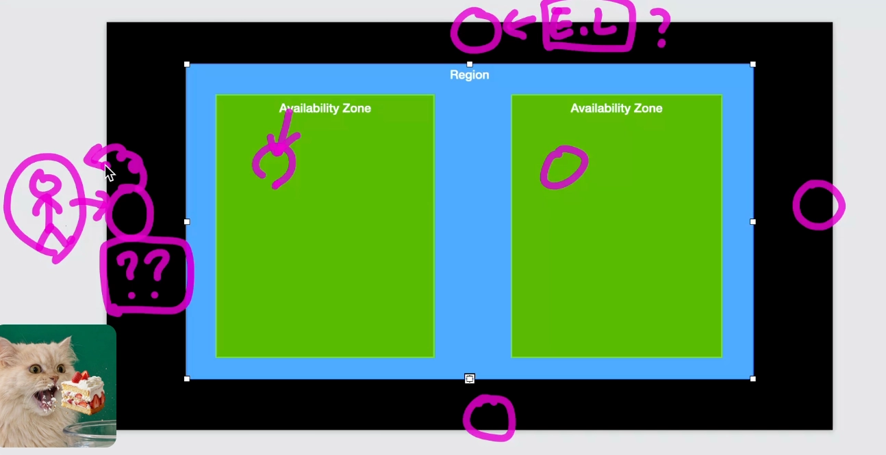
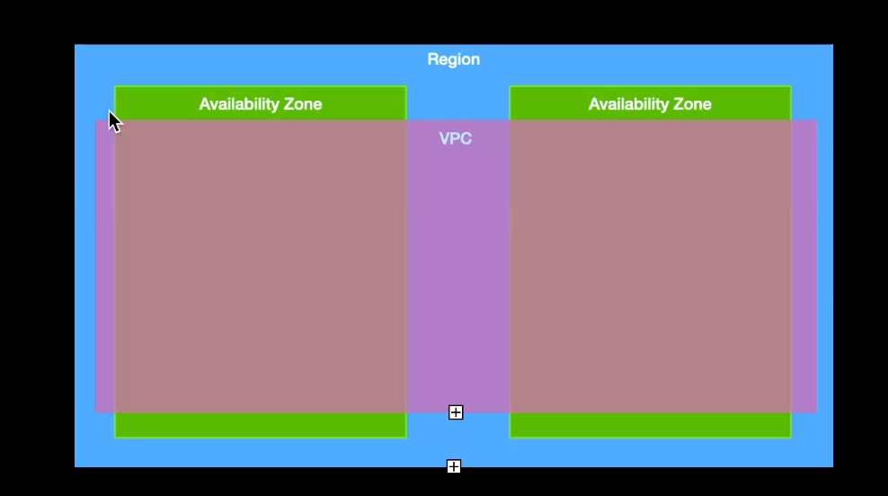
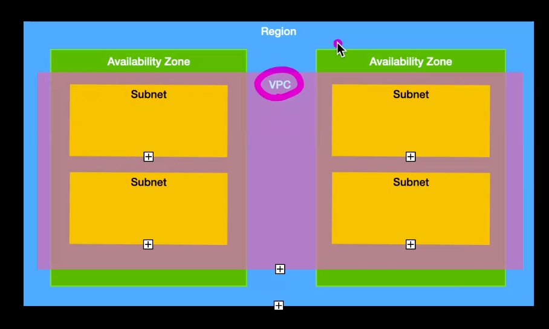
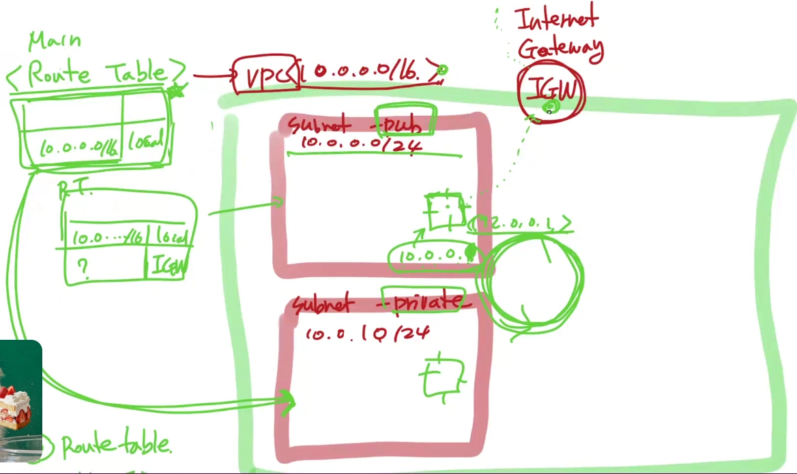
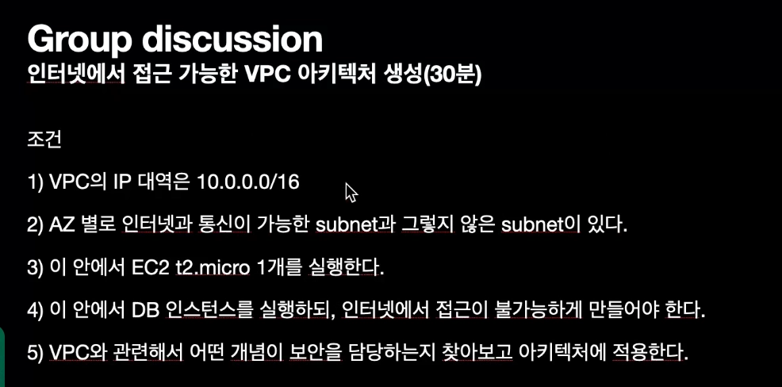
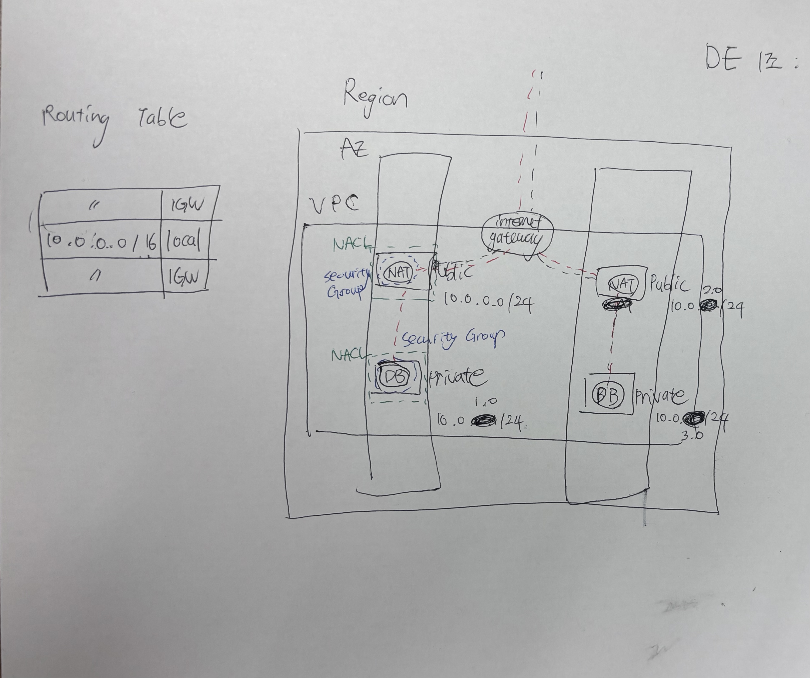

# 목차
- [목차](#목차)
- [AWS](#aws)
  - [Account](#account)
      - [인증 : 허용 대상](#인증--허용-대상)
      - [인가 : 허용 규칙](#인가--허용-규칙)
  - [Global Infra](#global-infra)
    - [Region](#region)
    - [Availability Zone = AZ = 가용 영역](#availability-zone--az--가용-영역)
    - [Edge Location](#edge-location)
  - [VPC : Virtual Private Cloud](#vpc--virtual-private-cloud)
    - [**Subnet**](#subnet)
    - [EC2에 접근하기 위한 필수 작업 \*\*](#ec2에-접근하기-위한-필수-작업-)
    - [Route Table](#route-table)
  - [Internet Gateway = IGW](#internet-gateway--igw)
    - [Security Group](#security-group)
  - [실습](#실습)

 
 

# AWS

## Account

#### 인증 : 허용 대상

- User(IAM), Group, Role,

#### 인가 : 허용 규칙

- Policy

 

## Global Infra

### Region

- AWS 서비스를 제공하는 도시의 이름과 코드(ex: 서울: ap-northeast-2)

 

### Availability Zone = AZ = 가용 영역

- 가용성을 제공하기 위한 논리적인 데이터 센터
    - 실제로 데이터 센터 존재? X.
    - 개념적으로 데이터 센터
- 하나의 리전은 최소 2개 이상의 AZ를 제공함

 

### Edge Location

- 리전 외의 추가 데이터 센터.
- 엣지 로케이션은 콘텐츠 배포 네트워크(CDN)의 중요한 구성 요소로 사용되며, 사용자와 물리적으로 가까운 위치에서 콘텐츠를 제공함으로써 지연 시간(Latency)을 줄이고 성능을 향상
    - AWS 의 CDN들의 여러 서비스들을 가장 빠른 속도로 제공하기 위한 거점
    
    
    
    - 바깥 사용자에게 빠르게 응답을 줘야 할 것은 Edge Location에 둠
- 리전과는 별개의 Infra Structure
    - 보통 리전 바깥

 

## VPC : Virtual Private Cloud

- EC2를 실행하기 위해 정의하는 가상의 사설 네트워크 망
- 일반적으로 사설망에는 인터넷에서 접근할 수 있는 방법이 제한되어 있으며 내부적으로는 private IP로 통신

- VPC는 가급적 사용X 회사에서도 안 씀
    - 보안적으로 좋은 게 하나도 없음

 

### **Subnet**

- VPC 안의 IP를 몇개의 대역으로 쪼개주는 그룹
- VPC의 IP를 그룹으로 분할하는 역할을 하는 추상적인 개념
- 의미적으로 public vs private 으로 분류
    - 기본적으로 private - 외부에서 접근 불가
        - Database, backend service 등 대부부분의 resource
    - public - 외부에서 접근 가능
    - 기본적으로 private 하나, public 하나 둠
        - private에는 public 보다 ip를 2배 정도 더 할당
- NAT 인스턴스

> AZ < Region
> 
> VPC < Region
>
> Subnet < AZ
> 
> Subnet < VPC

- EC2를 생성할 때 선택한 Subnet의 위치가 AZ를 결정할 수 있음

 

### EC2에 접근하기 위한 필수 작업 **

1. Route table 수정
2. public IP 
3. IGW 구멍 뚫어준다. 
4. Security Group 

  

### Route Table

- VPC 내부의 Routing을 명시하는 도구

## Internet Gateway = IGW

- VPC에서 public subnet이 외부와 연결하는 통로

 

### Security Group

- EC2의 인바운드 및 아웃바운드 트래픽을 제어하여 인스턴스를 보호하는 가상 방화벽

> VPC 방화벽
> 
> - Subnet : NACL  방화벽  ← All Open
>     - 여러 개의 EC2에 공통 적용하고 싶은 방화벽이 있을 때 사용
>    - Route table 과 IGW만 열면 subnet에 접근 가능함
> - EC2 : Security Group 방화벽 ← All Closed

 

## 실습

