# 목차
- [목차](#목차)
- [AWS](#aws)
  - [EC2](#ec2)
  - [Storage](#storage)
    - [S3 (Simple Storage Service)](#s3-simple-storage-service)
    - [EBS (Elastic Block Store)](#ebs-elastic-block-store)
    - [차이점 비교](#차이점-비교)
  - [접근 권한 관리](#접근-권한-관리)
    - [1. User : AWS 사용자](#1-user--aws-사용자)
    - [2. Group : 사용자의 모임 (그룹)](#2-group--사용자의-모임-그룹)
    - [3. Role](#3-role)
    - [4. Policy : 권한 부여 문서 (JSON)](#4-policy--권한-부여-문서-json)
  - [Serverless](#serverless)
    - [Serverless Computing : Lambda](#serverless-computing--lambda)
    - [Severless DB : DynamoDB](#severless-db--dynamodb)
    - [Serverless Storage : S3](#serverless-storage--s3)

 
 

# AWS

## EC2

- AWS에서 제공하는 Virtual Machine
- 시작 → 멈춤(Stop). 시작 → 종료(Terminate)

 

**Instance Type**
- T4g.micro
    - **T** : T type
    - **4** : Generation 4
    - **g** : Processor 종류
    - **micro** : Size

**< Instance Type Example >**
| Instance Size | vCPU | Memory (GiB) | Instance Storage | Network Bandwidth (Gbps) | EBS Bandwidth (Gbps) |
| --- | --- | --- | --- | --- | --- |
| m7g.medium | **1** | **4** | EBS-Only | Up to 12.5 | Up to 10 |
| m7g.large | **2** | **8** | EBS-Only | Up to 12.5 | Up to 10 |
- size가 2배씩 늘어남 → 성능이 더 좋아진다

 

## Storage

### S3 (Simple Storage Service)

- **저장 방식**: Object 단위의 읽기/쓰기
- **용량**: 저장공간에 제약이 없는 스토리지
- **접근 방식**: HTTP/HTTPS를 통한 REST API 접근
- **연결성**: 독립적으로 존재하며, 어디서든 접근 가능
- **사용 사례**:
    - 정적 파일 호스팅 (이미지, 동영상, 문서)
    - 백업 및 아카이빙
    - 데이터 레이크
    - 정적 웹사이트 호스팅

 

### EBS (Elastic Block Store)

- **저장 방식** : Block 단위의 읽기 / 쓰기 (파일 시스템 사용)
- **용량**: 볼륨 크기에 제한이 있음 (최대 64TB)
- **접근 방식**: 파일 시스템을 통한 접근 (ext4, NTFS 등)
- **연결성**: EC2 인스턴스에 연결되어야 사용 가능 (로컬 디스크처럼 사용)
- **사용 사례**:
    - 운영체제 및 부트 볼륨
    - 데이터베이스 스토리지
    - 애플리케이션 데이터
    - 빠른 I/O가 필요한 작업

 

### 차이점 비교

|  | S3 | EBS |
| --- | --- | --- |
| 저장 단위 | Object (파일 전체) | Block (작은 블록들) |
| 용량 제한 | 무제한 | 볼륨당 최대 64TB |
| 연결 방식 | 인터넷을 통한 독립 접근 | EC2 인스턴스에 연결 필수 |
| 속도 | 네트워크 속도에 의존 | 로컬 디스크처럼 빠름 |
| 비용 | 저렴 (저장량에 따라) | 상대적으로 비쌈 (프로비저닝) |
| 데이터 수정 | 전체 파일 교체 | 부분 수정 가능 |
- EBS가 S3보다 조금 더 독립적

 

**S3를 선택하는 경우:**

- 대량의 정적 파일 저장이 필요할 때
- 여러 서비스에서 동시에 접근해야 할 때
- 비용 효율적인 장기 저장이 필요할 때

 

**EBS를 선택하는 경우:**

- 데이터베이스와 같이 빠른 I/O가 필요할 때
- 운영체제나 애플리케이션 실행 환경이 필요할 때
- 파일의 일부만 자주 수정해야 할 때

 

## 접근 권한 관리

### 1. User : AWS 사용자

### 2. Group : 사용자의 모임 (그룹)

- 정책을 상속

### 3. Role

- 인증의 대상
- 성격
    1. 정책을 뒤집어 씌움: 유저가 사용
        
        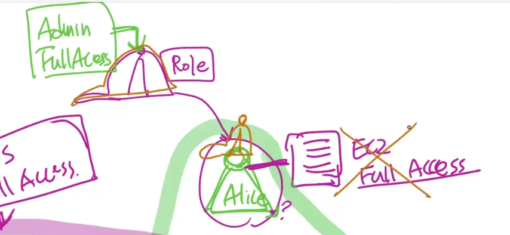
        
        - 말 그대로 모자, 모자(ROLE)을 쓰는 순간 원래 가지고 있던 EC2 Full Access 못함 대신 Admin Full Access 가능
        - 모자를 벗으면 원래 있던 EC2 Full Access만 가능
    2. 정책을 할당함 : AWS 리소스가 사용
        
        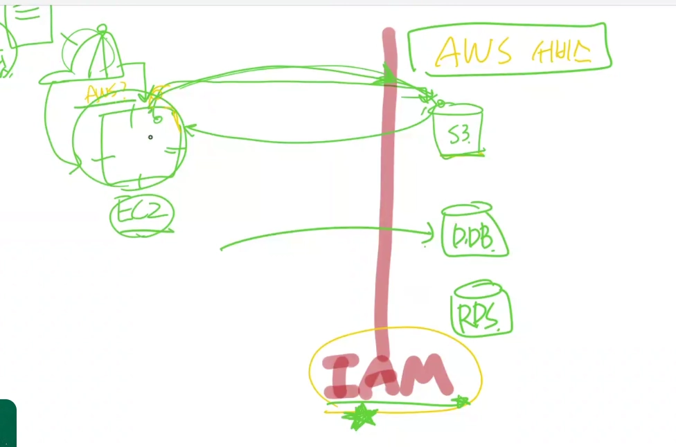
        
        - ec2가 같은 AWS 서비스라고 할지라도 리소스에 접급하려고 하면 IAM이 항상 권한을 물어봄

### 4. Policy : 권한 부여 문서 (JSON)

- ALLOW
- DENY

 

## Serverless

- Severless란 서버가 없는 것이 아님;;;
- 사람이 더 이상 서버에 대한 관리를 예전처럼 많이 하지 않아도 되는 것을 이야기 함

 

### Serverless Computing : Lambda

**특징**

- 기존 EC2 기반 서버 운영의 부담 : 상시 기동, 스케일링 관리, OS 패치
- “트래픽이 있을 때만 코드가 실행된다” 개념 도입
- 별도의 EC2 서버를 정의해서 만들지 않고 프로그래밍 언어로 구현한 코드를 실행할 수 있는 환경 : 로직(코드)에만 신경쓰면 된다
- 다양한 언어(및 runtime 환경)을 지원함
    - Node.js
    - Python
    - .NET
    - Ruby
    - Java
    - Go

 

**단, 제약조건이 존재함**

- 성능
- 실행 시간

 

왜 이런 제약 조건이 생기는걸까?

→ 필요할 때만 실행이 되기 때문에. 실행시간이 길지 않음

서버를 사용할 때는 위와 같은 제약 조건이 없었나? 진짜로?

 

> **중요한 특징**
> 
> 
> 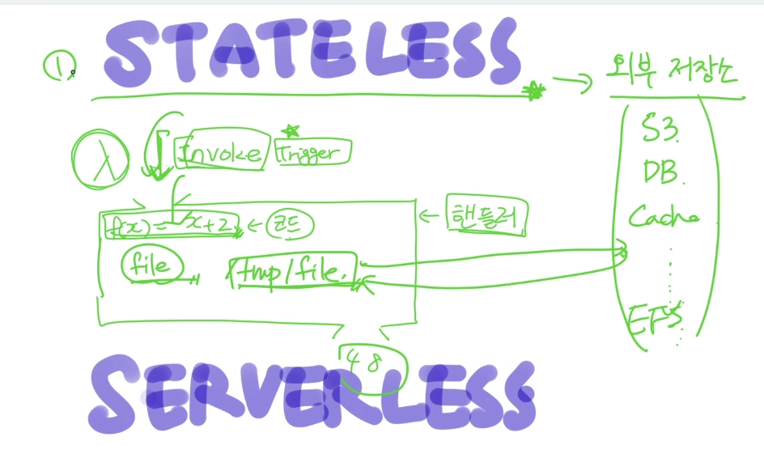
> 
> - **Stateless**
>     - 한 번 호출되고 나면 호출 과정에서 저장된 내용은 기록하지 않음
>     - 호출될 때마다 실행하는 환경을 새롭게 만듦
>         - 영구적으로 저장되어야 하는 파일은 외부 저장소에 저장해야함
>         - 외부저장소: S3, DB, Cache, EFS 등
> - **Serverless**
>     - 실행 성능을 조정해줘야 함
>         - 128MB ~ 10GB 메모리 성능만 결정함
>         - CPU, Network, Disk는 자동으로 결정됨
>     - 실행 시간 : 최대 15분
>         - 15분 이내에 실행되지 않는 코드라면 람다를 사용하는 것이 적합하지 않을 수 있음
>         - 람다에는 빠르게 실행되고 내려 가는 것을 작성

 

**단점**

- Cold start : 최초의 실행 시 runtime 환경을 구성하기 위해 시간이 걸림
    - 회피 방법!
        - **주기적인 호출 (수동)** - 이유 없이 호출해서 계속 인스턴스(실행 환경) 살아있게
        - **Concurrency 관리 (자동)**
        
        ⇒ 돈이 들음
        

 

**Lambda의 구성요소**

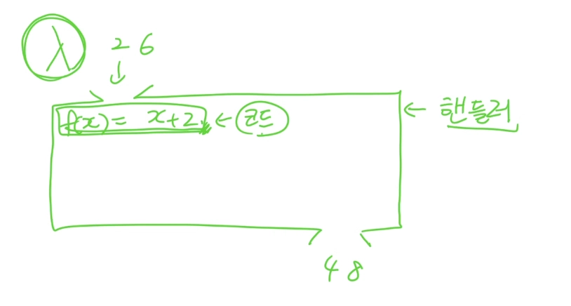

- **핸들러(Handler)**: 진입점 함수 (main 함수), 이벤트/컨텍스트 파라미터
- **런타임(Runtime):** 지원 언어, 커스텀 런타임 개념
- 리소스 설정
    - 메모리 할당 → CPU 성능과 비례한다는 점 (실무에서 자주 놓치는 포인트)
    - 타임아웃 설정 (최대 15분 제한)
- **실행 역할(Execution Role/IAM)**: Lambda가 다른 AWS 서비스에 접근하려면 반드시 필요
    
    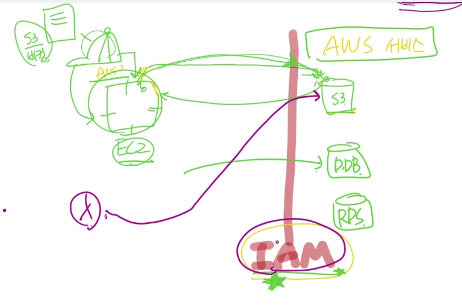
    
    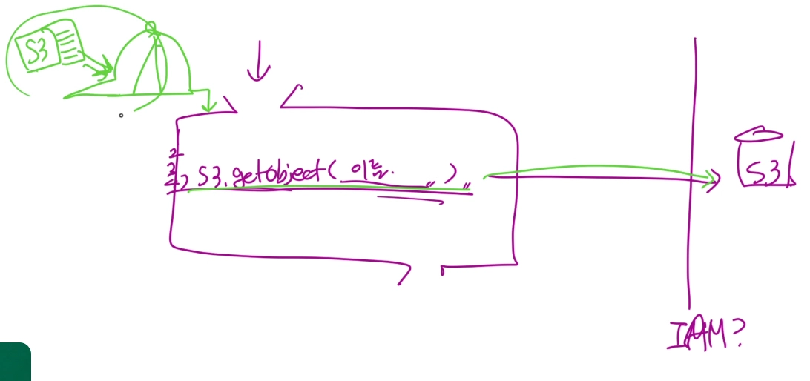
    
    
    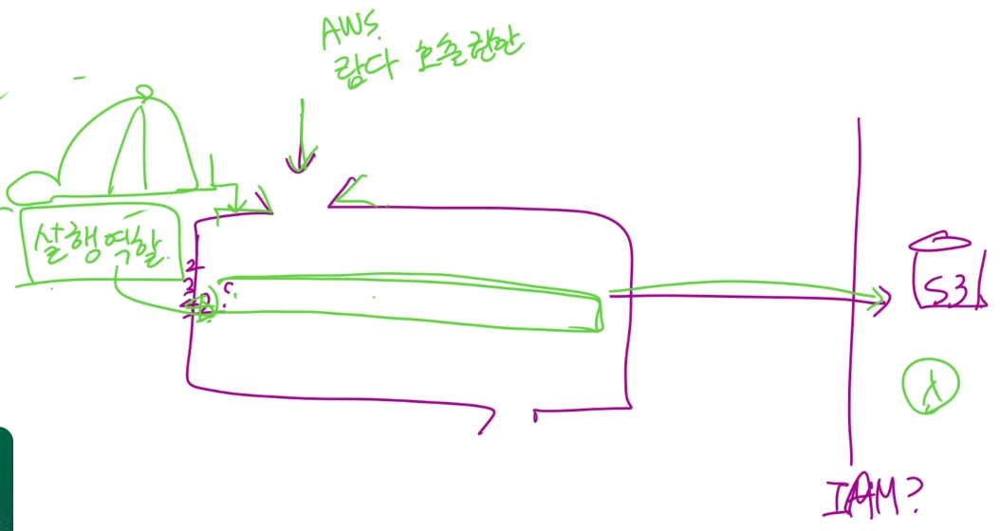
    
    두가지 권한 필요
    
    - 람다를 실행할 권한
    - 람다 함수내에서 다른 AWS에 접근할 권한 = 실행 역할
- **Trigger** 필요

 

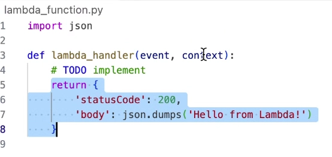

- 위 함수를 실행하려면 Trigger를 지정해야 함
- main 함수를 lambda_handler함수가 아닌 다른 함수로도 지정할 수 있음
    - 람다 함수의 재활용도 가능함
        - 하나의 코드에 여러개의 람다 함수를 만들어서

 

### Severless DB : DynamoDB

**특징**

- NoSQL DB
- 일관성 종류가 두가지
    - default: **Eventual consistency** (최종 일관성)
    - **Strong consistency** (강력한 일관성)
- Severless
    - 성능 : 읽기, 쓰기 성능을 초당 얼마로 할지를 결정해줘야 함
        - 성능과 비용이 비례

 

**구조**

- 테이블(Table)  —— 이게 RDB의 DB. 테이블의 상위개념인 Database가 존재하지 않음
- 아이템(Item) —— row
- 속성(Attribute)  —— column
- Primary Key 구조: 파티션 키가 데이터 분산 방식을 결정 → 성능/확장성에 직결
    - Partition Key  —— Primary key
    - Sort Key

 

**데이터베이스의 일관성 : CAP 이론**  → PACELC [최신]

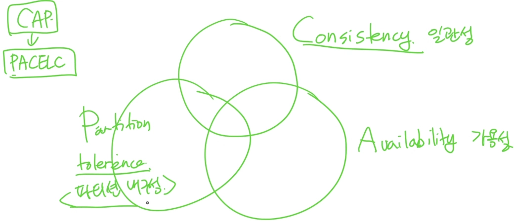

- 데이터 베이스의 분산환경에 있으면, 세 개 중 하나는 포기해야함
- but 분산 환경이면 무조건 P는 필요함
    - CP : 강력한 (Strong) consistency
    - AP : 최종적 (Eventual) consistency
- **일관성** : 무슨일 있어도 최신 값을 응답하겠다.
    - 답이 느릴 수 있어도 신뢰도 높음
- **가용성** : 최신 값이 아니어도 어쨌든 응답은 하겠다.
    - 한 번만 더 물어봐.. 최종적으로는 최신 값으로 업데이트 되어있을 테니까, 최신값을 응답할 수 있어

 

### Serverless Storage : S3

**특징**

- **"무제한 확장 가능한 완전관리형 객체 스토리지"**
- EC2에 파일을 두면 발생하는 문제: 서버 장애 시 데이터 유실, 확장 시 파일 동기화 이슈
- 브라우저를 이용해서 업로드/다운로드가 가능
- Object Storage
- 업로드하는 파일 크기에 대한 제약은 있지만, 저장 공간 자체에 대한 제약은 없음
    - 저장 공간을 관리하지 않기 때문에 serverless

 

**핵심 개념: 버킷과 오브젝트**

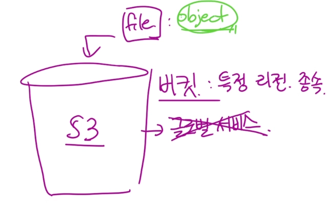

- **버킷(Bucket)**: 최상위 컨테이너, 네임스페이스. 전역적으로 고유한 이름
    - 특정 리전에 종속되기 때문에 S3는 글로벌 서비스 아님
- **객체(Object)**: 실제 파일 데이터 + 메타데이터
- **키(Key)**: 객체의 고유 식별자 (경로처럼 보이지만 실제로는 폴더 구조가 아님)
    
    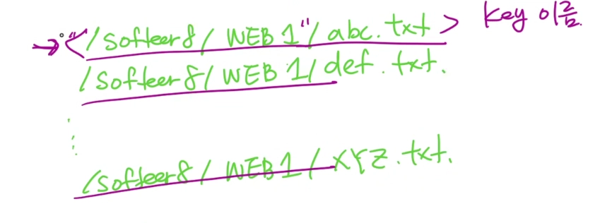
    
- Object 읽기/쓰기/삭제 기능
    - C: 쓰기 == 업로드
        - 각각의 object마다 url이 발생해서 접근 가능
    - R: 읽기 == 다운로드
        - Presigned URL (제한 시간 내로 다운로드 가능한 URL도 있음)
    - U: 수정 X , 다운로드 → 수정 → 업로드
    - D: 삭제
        - **versioning** : 업로드했던 파일들이 다 살아있음. 비쌈
            - 몇 번째 버전까지 관리할 건지 판단해야 함

 

**접근 권한**

- 기본은 Private (모든 신규 버킷/객체)
- 버킷 정책 vs IAM 정책: 누가 설정하는 주체인지의 차이
- Block Public Access 설정: 실수로 인한 데이터 노출 방지
- Presigned URL: 임시 접근 권한 부여

 

> 이번 프로젝트에서는
> 
> 1. 이미지 저장소
> 2. 정적 웹사이트 배포 도구
> 
> 정도로 사용할 수 있음
> 
> - Cloud Front와 연결해서 사용

 

**그 외**

API Gateway, SQS, SNS, EventBridge 등

- 얘네 전부 람다의 trigger가 됨

람다와 람다 사이의 순서를 정의하는 도구 : Step Function

- DE는 은근 많이 사용