# 목차
- [목차](#목차)
- [DE : Apache Spark](#de--apache-spark)
  - [Hadoop 배경](#hadoop-배경)
    - [**왜 Hadoop의 탄생 배경을 이해해야 할까?**](#왜-hadoop의-탄생-배경을-이해해야-할까)
    - [2000년대 초반의 시대적 배경](#2000년대-초반의-시대적-배경)
    - [Hadoop은 어떤 문제를 해결하기 위해 만들어졌는가?](#hadoop은-어떤-문제를-해결하기-위해-만들어졌는가)
  - [Spark 배경](#spark-배경)
    - [왜 Spark의 탄생 배경을 이해해야 하는가?](#왜-spark의-탄생-배경을-이해해야-하는가)
    - [2010년대 초반의 시대적 배경](#2010년대-초반의-시대적-배경)
    - [Spark는 어떤 문제를 해결하기 위해 만들어졌는가?](#spark는-어떤-문제를-해결하기-위해-만들어졌는가)
    - [시대적 배경 비교 – Hadoop MR vs. Spark](#시대적-배경-비교--hadoop-mr-vs-spark)
    - [해결한 문제 비교 – Hadoop MR vs. Spark](#해결한-문제-비교--hadoop-mr-vs-spark)
  - [Apache Spark](#apache-spark)
    - [Apache Spark](#apache-spark-1)
    - [Hadoop Components](#hadoop-components)
    - [Apache Spark](#apache-spark-2)
    - [Apache Spark Architecture](#apache-spark-architecture)
    - [Apache Spark의 특징](#apache-spark의-특징)
    - [왜 Spark를 사용하는가?](#왜-spark를-사용하는가)
    - [Hadoop MapReduce와 Spark 비교](#hadoop-mapreduce와-spark-비교)
    - [Hadoop MapReduce와 Spark 비교](#hadoop-mapreduce와-spark-비교-1)
  - [클러스터 매니저 종류](#클러스터-매니저-종류)
  - [Deploy Options](#deploy-options)
  - [Driver \& Executors](#driver--executors)
    - [Driver](#driver)
    - [Executors](#executors)
    - [Scheduling side vs Executor side](#scheduling-side-vs-executor-side)
  - [Local 모드와 두 가지 배포 모드(Cluster / Client)](#local-모드와-두-가지-배포-모드cluster--client)
    - [deploy-mode](#deploy-mode)
    - [Client vs Cluster](#client-vs-cluster)
    - [Different Execution Modes across the cluster](#different-execution-modes-across-the-cluster)
  - [Running Spark on Kubernetes](#running-spark-on-kubernetes)
  - [In-memory Processing](#in-memory-processing)
  - [spark-submit](#spark-submit)
  - [Spark Standalone 모드](#spark-standalone-모드)
  - [YARN에서 Spark 실행](#yarn에서-spark-실행)
    - [Spark 배포판의 두 가지 유형](#spark-배포판의-두-가지-유형)
  - [Pandas API on Spark](#pandas-api-on-spark)
    - [왜 pandas on Spark를 사용하는가?](#왜-pandas-on-spark를-사용하는가)
    - [regular pandas의 한계](#regular-pandas의-한계)
    - [pandas on Spark의 장점](#pandas-on-spark의-장점)
    - [pandas on Spark의 한계](#pandas-on-spark의-한계)
    - [pandas on Spark와 일반 pandas 함께 사용하기](#pandas-on-spark와-일반-pandas-함께-사용하기)

<br>
<br>

# DE : Apache Spark

## Hadoop 배경

### **왜 Hadoop의 탄생 배경을 이해해야 할까?**

"Hadoop을 진정으로 이해하려면, 먼저 Hadoop이 탄생하게 된 시대적 배경을 이해해야 한다."

<br>

### 2000년대 초반의 시대적 배경

**웹 데이터의 폭발적 증가**

- Google, Yahoo, Facebook은 크롤링 로그(crawl logs), 클릭스트림(clickstreams), 소셜 게시물(social posts)과 같은 **방대한 비정형 데이터**를 색인(Indexing), 저장, 분석하고 있었다.

**당시의 기술 환경**

- **클라우드가 없던 시대**: 모든 시스템이 온프레미스(On-Premises) 환경에서 운영되었다.
- **서버는 저렴하지만 신뢰성이 낮은 범용 하드웨어(Commodity Hardware)**를 사용했다.
- **기존의 관계형 데이터베이스(RDBMS)**는 페타바이트(PB) 규모의 데이터를 수평적으로 확장(Scale-out)하여 처리할 수 없었다.

**Google의 논문에서 영감을 받음**

- Google File System(2003) → HDFS(Hadoop Distributed File System)
- Google MapReduce(2004) → Hadoop MapReduce

<br>

### Hadoop은 어떤 문제를 해결하기 위해 만들어졌는가?

**⇒ 저렴한 하드웨어와 병렬 처리를 활용**하여 **대규모 데이터를 안정적으로 저장하고 효율적으로 처리하는 것**이 Hadoop의 목표

<br>

## Spark 배경

### 왜 Spark의 탄생 배경을 이해해야 하는가?

**"Spark를 진정으로 이해하려면, 먼저 Spark가 탄생한 시대적 배경을 이해해야 한다."**

<br>

### 2010년대 초반의 시대적 배경

**빅데이터와 실시간 활용 사례의 폭발적 증가**

- Twitter, Netflix, Uber와 같은 기업들은 로그(logs), 사용자 행동(user behavior), IoT 데이터, 추천 시스템 등 **실시간 스트리밍 데이터**를 생성하고 분석하기 시작하였다.

**당시의 기술 환경**

- AWS, GCP, Azure를 중심으로 **클라우드 도입이 빠르게 확산**되었다.
- Hadoop은 강력한 프레임워크였지만 **배치 처리 중심**으로 설계되어 실시간 처리에는 속도가 느렸다.
- 이에 따라 **더 빠른 인메모리(In-Memory) 기반의 반복적 데이터 처리 프레임워크**에 대한 수요가 증가하였다.

**연구와 산업 동향에서 영감을 받음**

- Spark는 **UC Berkeley의 AMPLab**에서 2010년에 개발되었다.
- Hadoop MapReduce의 **속도와 유연성의 한계를 극복**하기 위해 설계되었다.
    - 장애 허용성과 성능 향상을 위해 **RDD(Resilient Distributed Dataset)** 개념을 도입하였다.
    - 배치 처리, 스트리밍, SQL, 머신러닝을 하나의 엔진에서 수행할 수 있는 **통합 데이터 처리 엔진**으로 설계되었다.

<br>

### Spark는 어떤 문제를 해결하기 위해 만들어졌는가?

**Hadoop MapReduce의 한계**를 넘어, **대규모 데이터셋에 대해 배치 처리, 스트리밍, 머신러닝** 등 **다양한 작업을 빠르고 유연하게** **인메모리 방식**으로 처리할 수 있도록 하는 것을 목표로 하였다.

<br>

### 시대적 배경 비교 – Hadoop MR vs. Spark

| 구분 | Hadoop MR (2000년대 초반) | Spark (2010년대 초반) |
| --- | --- | --- |
| **데이터 폭증** | Google, Yahoo, Facebook의 웹 규모 비정형 데이터 | **Twitter, Netflix, Uber**의 실시간 및 스트리밍 데이터 |
| **컴퓨팅 환경** | 클라우드가 없는 온프레미스(On-Premises) 환경 | AWS, GCP, Azure를 중심으로 클라우드가 빠르게 확산 |
| **하드웨어** | 저렴하지만 신뢰성이 낮은 범용(Commodity) 서버 | 여전히 범용 하드웨어를 사용하지만 더 많은 RAM과 향상된 CPU를 제공 |
| **저장소의 한계** | 기존 데이터베이스는 페타바이트(PB) 규모까지 확장하기 어려웠음 | Hadoop으로 대규모 저장은 가능했지만 실시간 처리 기능은 부족하였음 |
| **설계 배경** | Google GFS(2003) → HDFSGoogle MapReduce(2004) → Hadoop MapReduce | UC Berkeley AMPLab(2012)에서 개발됨MapReduce의 경직성과 느린 처리 속도를 극복하기 위해 설계됨 |
| **주요 요구사항** | 대규모 데이터를 안정적으로 저장하고 처리하는 것 | 데이터를 빠르게 인메모리 방식으로 처리하고, 반복 연산과 스트리밍 작업을 지원하는 것 |

<br>

### 해결한 문제 비교 – Hadoop MR vs. Spark

| 항목 | Hadoop MR | Spark |
| --- | --- | --- |
| **활용 사례** | Google, Yahoo, Facebook은 크롤링 로그(crawl logs), 클릭스트림(clickstreams), 소셜 게시물(social posts)과 같은 대규모 비정형 데이터를 색인하고, 저장하며, 분석하였다. | Twitter, Netflix, Uber와 같은 기업들은 로그(logs), 사용자 행동(user behavior), IoT, 추천 시스템 등의 실시간 스트리밍 데이터를 생성하고 분석하였다. |
| **해결하고자 한 핵심 문제** | 저렴한 하드웨어를 이용하여 대규모 데이터를 효율적으로 저장하고 처리하는 것 | 배치 처리, 스트리밍, 머신러닝을 위한 빠르고 유연한 인메모리 데이터 처리 |
| **처리 모델** | 디스크 기반의 배치 전용 MapReduce | 인메모리 기반의 통합 엔진(배치 처리, 스트리밍, 머신러닝, SQL 지원) |
| **성능** | 디스크 I/O와 배치 처리 방식으로 인해 높은 지연 시간(Latency)이 발생함 | 인메모리 연산을 통해 훨씬 빠른 처리 성능을 제공함 |
| **주요 활용 분야** | 대규모 ETL, 오프라인 데이터 분석 | 실시간 분석, 그래프 처리, 머신러닝, 대화형 SQL |
| **장애 허용(Fault Tolerance)** | 데이터 복제(Replication)와 MapReduce 작업 재실행(Re-execution)을 통해 구현함 | RDD(Resilient Distributed Dataset)의 계보(Lineage) 정보를 활용하여 구현함 |

<br>

## Apache Spark

### Apache Spark

Apache Spark™는 단일 노드 또는 클러스터 환경에서 데이터 엔지니어링, 데이터 사이언스, 머신러닝 작업을 수행하기 위한 다중 언어(Multi-language) 데이터 처리 엔진이다.

<br>

### Hadoop Components

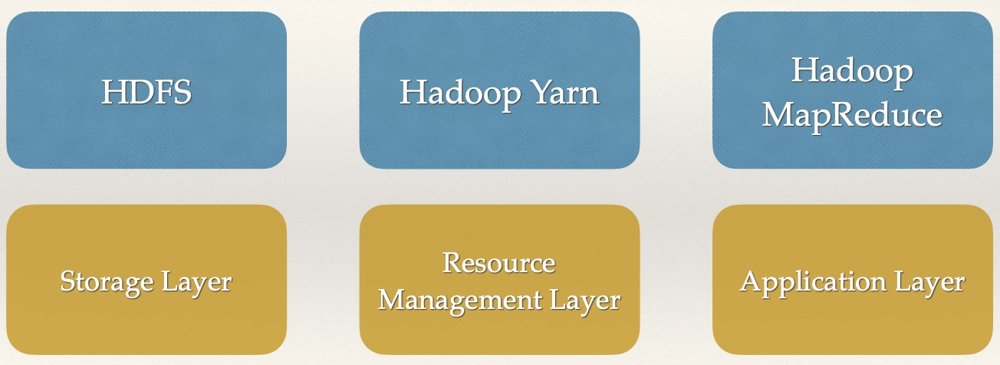
https://jcsites.juniata.edu/faculty/rhodes/smui/images/hadooparch1.gif

<br>

### Apache Spark

- Apache Spark는 **대규모 데이터 처리를 위한 통합 분석 엔진(Unified Analytics Engine)**이다.
- Java, Scala, Python, R에서 사용할 수 있는 **고수준 API**를 제공하며, 일반적인 실행 그래프(Execution Graph)를 지원하는 **최적화된 실행 엔진**을 제공한다.
- 또한 다음과 같은 다양한 고수준 도구를 지원한다.
    - **Spark SQL**: SQL 및 구조화된 데이터 처리
    - **pandas API on Spark**: pandas 기반 데이터 처리
    - **MLlib**: 머신러닝
    - **GraphX**: 그래프 데이터 처리
    - **Structured Streaming**: 증분 연산(Incremental Computation) 및 스트림 처리

<br>

### Apache Spark Architecture

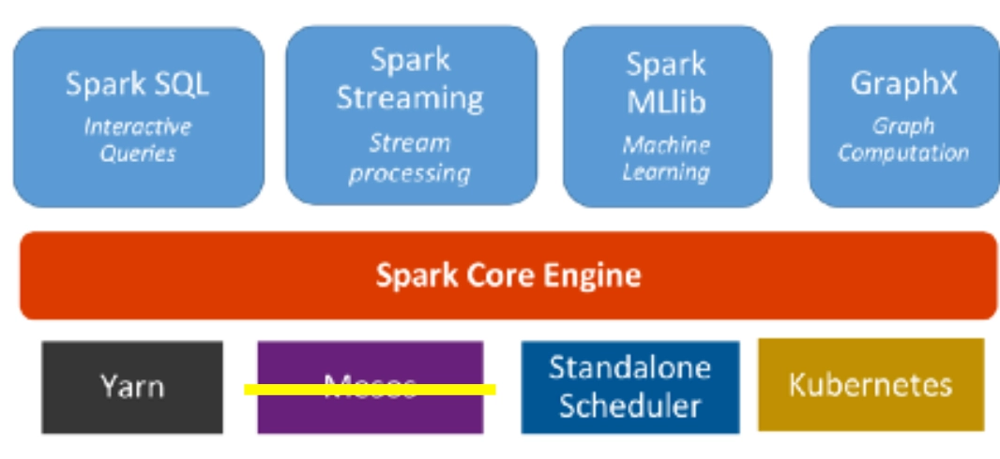

<br>

### Apache Spark의 특징

**Simple (간단함)**

- Python, SQL, Scala, Java, R 등 사용자가 선호하는 언어를 사용하여 **배치 처리와 실시간 스트리밍 데이터를 통합적으로 처리**할 수 있다.

**Fast (빠름)**

- **페타바이트(PB) 규모의 데이터**에 대해 다운샘플링 없이 탐색적 데이터 분석(EDA)을 수행할 수 있다.
- 빠른 분산 ANSI SQL 쿼리를 지원하여 대시보드와 애드혹(Ad-hoc) 리포팅을 효율적으로 수행할 수 있으며, 대부분의 데이터 웨어하우스보다 빠른 성능을 제공한다.

**Scalable (확장성)**

- 노트북 환경에서 머신러닝 모델을 학습한 후, 동일한 코드를 사용하여 **수천 대의 머신으로 구성된 장애 허용(Fault-Tolerant) 클러스터**까지 손쉽게 확장할 수 있다.

**Unified (통합성)**

- 하나의 엔진에서 **배치 처리, 실시간 스트리밍, SQL 분석, 데이터 사이언스, 머신러닝**을 모두 수행할 수 있다.

<br>

### 왜 Spark를 사용하는가?

**속도 (Speed)**

- Spark는 **인메모리(In-Memory) 컴퓨팅**을 기반으로 하기 때문에 Hadoop MapReduce와 같은 기존의 빅데이터 처리 도구보다 더 빠른 처리 성능을 제공한다.

**사용 편의성 (Ease of Use)**

- Java, Scala, Python, R 등 다양한 언어에서 사용할 수 있는 **고수준 API**를 제공하여 복잡한 데이터 처리 작업을 보다 쉽게 구현할 수 있다.

**다양한 활용성 (Versatility)**

- 배치 처리(Batch Processing), 대화형 질의(Interactive Queries), 스트리밍 데이터 처리(Streaming Data), 머신러닝(Machine Learning) 등 다양한 워크로드를 지원한다.

**통합 플랫폼 (Unified Platform)**

- 다양한 유형의 데이터 처리 작업을 하나의 플랫폼에서 수행할 수 있으므로, 작업마다 서로 다른 도구를 사용할 필요가 없다.

<br>

### Hadoop MapReduce와 Spark 비교

**속도 (Speed)**

- Spark는 **인메모리(In-Memory) 컴퓨팅**을 활용하여 중간 결과를 디스크에 저장하는 과정을 최소화하므로, Hadoop MapReduce보다 일반적으로 더 빠른 처리 성능을 제공한다.

**사용 편의성 (Ease of Use)**

- Spark는 Scala, Python, Java 등 다양한 언어의 **고수준 API**를 제공하여 복잡한 데이터 처리 작업을 보다 쉽게 구현할 수 있다.

**범용성 (Generality)**

- Hadoop MapReduce는 주로 **배치 처리**를 위해 설계되었지만, Spark는 **배치 처리, 대화형 질의(Interactive Queries), 스트리밍 데이터 처리, 반복 알고리즘(Iterative Algorithms)** 등 다양한 워크로드를 지원한다.

**장애 허용성 (Fault Tolerance)**

- Hadoop MapReduce와 Spark는 모두 장애 허용 기능을 제공한다.
- Spark는 **RDD(Resilient Distributed Dataset)**와 **Lineage(계보) 정보**를 활용하여 장애를 복구한다.
- Hadoop MapReduce는 **데이터 복제(Replication)**와 **작업 재실행(Re-execution)**을 통해 장애를 복구한다.

<br>

### Hadoop MapReduce와 Spark 비교

**속도 (Speed)**

- Spark는 **인메모리(In-Memory) 컴퓨팅**을 활용하여 중간 결과를 디스크에 저장하는 과정을 최소화하므로, Hadoop MapReduce보다 일반적으로 더 빠른 처리 성능을 제공한다.

**사용 편의성 (Ease of Use)**

- Spark는 Scala, Python, Java 등 다양한 언어의 **고수준 API**를 제공하여 복잡한 데이터 처리 작업을 보다 쉽게 구현할 수 있다.

**범용성 (Generality)**

- Hadoop MapReduce는 주로 **배치 처리**를 위해 설계되었지만, Spark는 **배치 처리, 대화형 질의(Interactive Queries), 스트리밍 데이터 처리, 반복 알고리즘(Iterative Algorithms)** 등 다양한 워크로드를 지원한다.

**장애 허용성 (Fault Tolerance)**

- Hadoop MapReduce와 Spark는 모두 장애 허용 기능을 제공한다.
- Spark는 **RDD(Resilient Distributed Dataset)**와 **Lineage(계보) 정보**를 활용하여 장애를 복구한다.
- Hadoop MapReduce는 **데이터 복제(Replication)**와 **작업 재실행(Re-execution)**을 통해 장애를 복구한다.

<br>

## 클러스터 매니저 종류

**Standalone 모드**

- Standalone 모드에서는 Spark가 자체적으로 클러스터를 관리한다.
- Spark를 가장 간단하게 배포할 수 있는 방식이지만, 클러스터 관리 기능에는 한계가 있다.

**YARN 모드**

- YARN(Yet Another Resource Negotiator)은 Hadoop의 **리소스 관리 플랫폼**이다.
- Spark는 YARN 위에서 실행될 수 있으며, YARN의 리소스 할당 및 관리 기능을 활용할 수 있다.

**Kubernetes 모드**

- Spark는 컨테이너 오케스트레이션 플랫폼인 **Kubernetes**에서도 실행할 수 있다.
- Kubernetes는 Spark 애플리케이션에 **리소스 격리(Resource Isolation)**와 **확장성(Scalability)**을 제공한다.

<br>

## Deploy Options

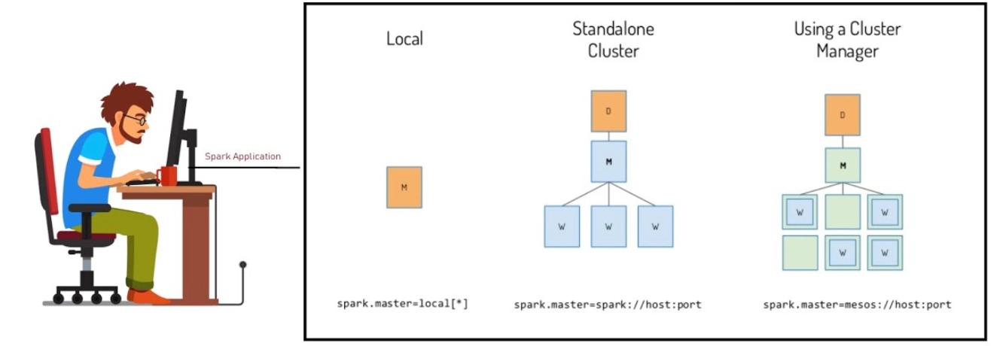
https://www.youtube.com/watch?app=desktop&v=Zm0fiUuvkek

https://www.researchgate.net/publication/330614514_IMOS_improved_Meta-aligner_and_Minimap2_On_Spark

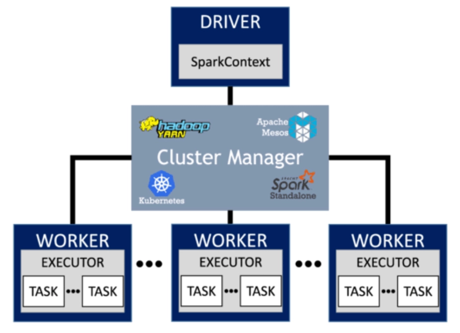

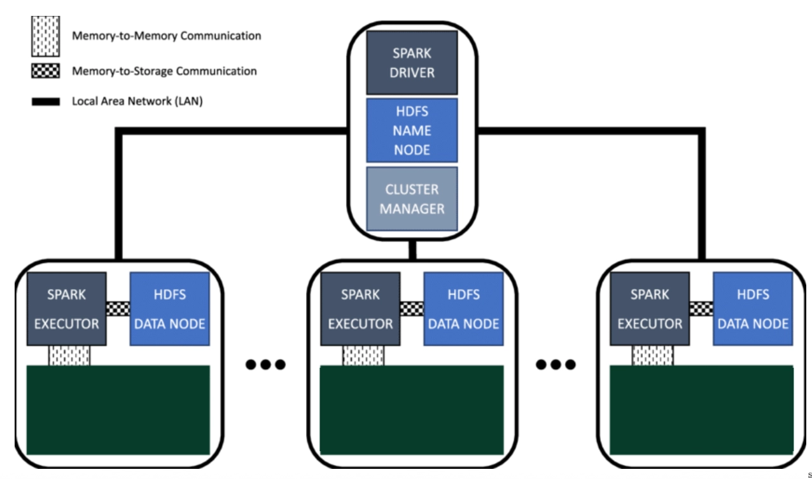

<br>

## Driver & Executors

### Driver

- Driver는 **Spark 애플리케이션의 실행을 총괄하는 메인 프로세스**이다.
- SparkSession과 SparkContext를 생성하거나 관리한다.
- 연산의 **DAG(Directed Acyclic Graph, 방향성 비순환 그래프)**와 RDD의 상태(State) 등 애플리케이션의 전반적인 정보를 관리한다.

### Executors

- Executor는 **Spark 애플리케이션의 실제 연산을 수행하고 데이터를 저장하는 프로세스**이다.
    - 데이터가 저장되어있는 곳
- Task를 실행하고, 중간 결과를 메모리 또는 디스크에 저장하는 역할을 담당한다.
- 클러스터의 각 노드에서 실행되며, Driver와 통신하여 작업(Task)을 전달받고 실행 결과 및 상태를 보고한다.

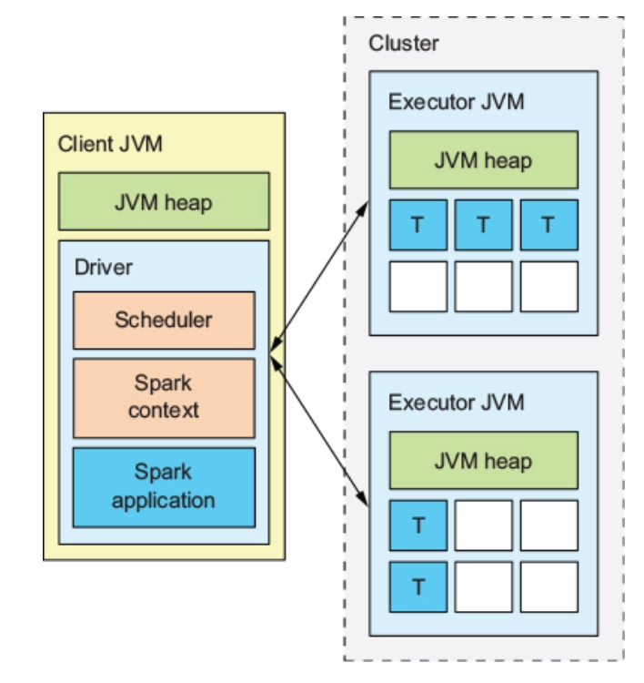

<br>

- Spark는 **기반이 되는 클러스터 매니저에 종속되지 않는다(Cluster Manager Agnostic)**. Executor 프로세스를 할당받고 Executor 간 통신만 가능하다면, YARN이나 Kubernetes처럼 다른 애플리케이션도 함께 관리하는 클러스터 매니저에서도 쉽게 실행할 수 있다.
- Driver 프로그램은 실행되는 동안 Executor로부터 들어오는 연결을 지속적으로 수신하고 처리해야 한다(예: `spark.driver.port` 설정). 따라서 Driver는 **Worker 노드에서 네트워크를 통해 접근할 수 있는 위치**에 있어야 한다.
    - **!!!! Driver 프로그램이 Worker 노드와 직접 통신이 가능해야 한다.**
    - Hadoop의 Application Master와 하는 일이 비슷
- Driver는 클러스터의 작업(Task)을 스케줄링하므로 **Worker 노드와 가까운 위치**, 가능하면 동일한 **LAN(Local Area Network)**에서 실행하는 것이 좋다. 원격에서 클러스터에 요청을 보내야 하는 경우에는, Worker와 멀리 떨어진 곳에서 Driver를 실행하기보다 **Driver에 RPC(Remote Procedure Call)로 요청을 전달하여 Driver가 가까운 위치에서 작업을 제출하도록 하는 것이 더 효율적**이다.

<br>

https://www.researchgate.net/figure/Apache-Spark-on-Yarn-architecture_fig1_336737403

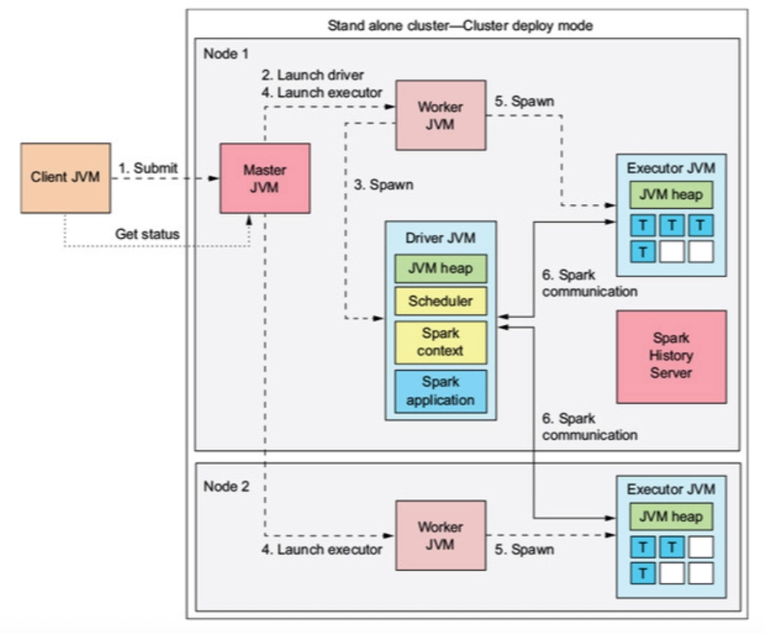

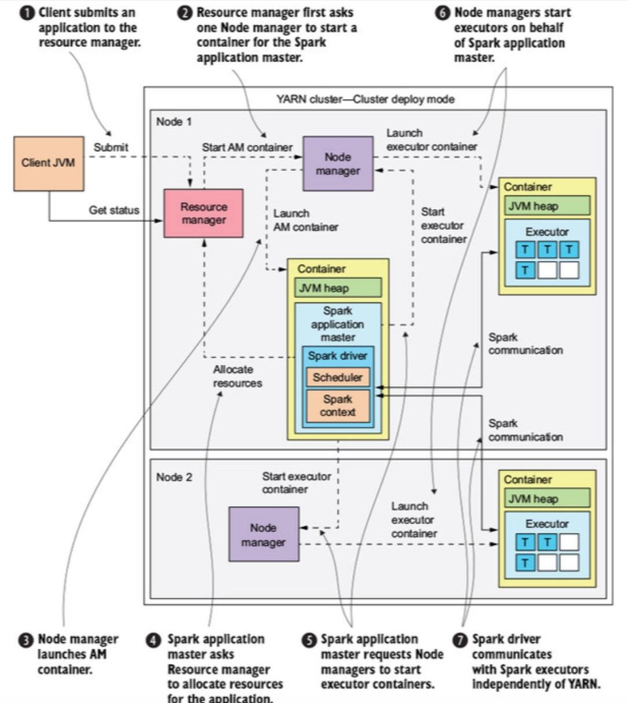

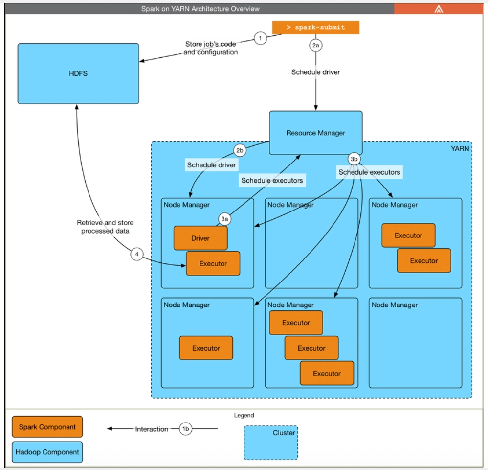

- hadoop mapreduce에서 - map mapper.py, - reduce reduce.py를 각각 지정함. 그렇게 하는 이유?
    - 사전정보 없이 .py에 정해진 Task만 수행하면 끝. - 역할 구분 확실히
- spark는 mapreduce보다 더 복잡.

<br>

### Scheduling side vs Executor side

- 각 Spark 애플리케이션은 **자신만의 Executor 프로세스**를 할당받으며, 이 Executor는 애플리케이션이 종료될 때까지 유지되고 여러 스레드에서 Task를 실행한다.
- 이러한 구조는 애플리케이션 간 **격리(Isolation)**를 제공한다.
    - **스케줄링 측면(Scheduling Side)**에서는 각 Driver가 자신의 Task만 스케줄링한다.
    - **Executor 측면(Executor Side)**에서는 서로 다른 애플리케이션의 Task가 각각 별도의 JVM(Java Virtual Machine)에서 실행된다.
- 하지만 이러한 구조로 인해 **서로 다른 Spark 애플리케이션(SparkContext instances) 간에는 데이터를 직접 공유할 수 없다.** 따라서 데이터를 공유하려면 HDFS, 데이터베이스, 객체 스토리지와 같은 **외부 저장소(External Storage System)**에 데이터를 저장한 후 다시 읽어와야 한다.

<br>

## Local 모드와 두 가지 배포 모드(Cluster / Client)

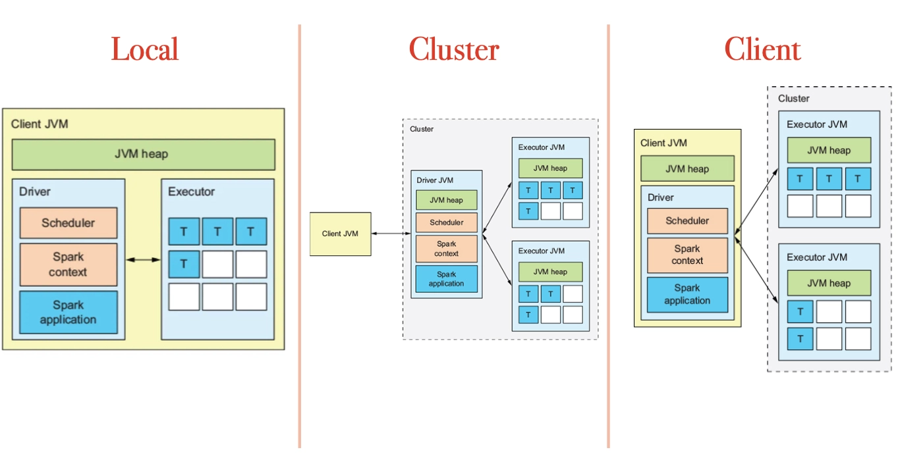

**Local 모드**

- Local 모드는 **Cluster 모드와 Client 모드와는 다른 실행 방식**이다.
- 하나의 Spark 애플리케이션 전체를 **단일 머신에서 실행**하며, 하나의 머신에서 여러 스레드를 사용하여 병렬 처리를 수행한다.
- Spark를 학습하거나 애플리케이션을 테스트하고, 로컬 환경에서 반복적으로 개발할 때 가장 많이 사용하는 방식이다.

**Cluster 모드**

- Cluster 모드는 **가장 일반적으로 사용되는 Spark 실행 방식**이다.
- 사용자는 컴파일된 JAR 파일, Python 스크립트 또는 R 스크립트를 클러스터 매니저에 제출한다.
- 클러스터 매니저는 클러스터 내부의 Worker 노드에서 **Driver 프로세스와 Executor 프로세스**를 모두 실행한다.
- 따라서 **Spark 애플리케이션과 관련된 모든 프로세스는 클러스터 매니저가 관리**한다.

**Client 모드**

- Client 모드는 Cluster 모드와 거의 동일하지만 **Driver가 클라이언트 머신에서 실행**된다는 점이 다르다.
- 즉, **클라이언트 머신이 Driver 프로세스를 관리**하고, **클러스터 매니저는 Executor 프로세스만 관리**한다.
- 이러한 클라이언트 머신은 일반적으로 **Gateway Machine** 또는 **Edge Node**라고 부른다.

<br>

### deploy-mode

linkedin.com/posts/suma-donoju-b71980256_clientmode-clustermode-spark-activity-7164848716279992320-b1p2/

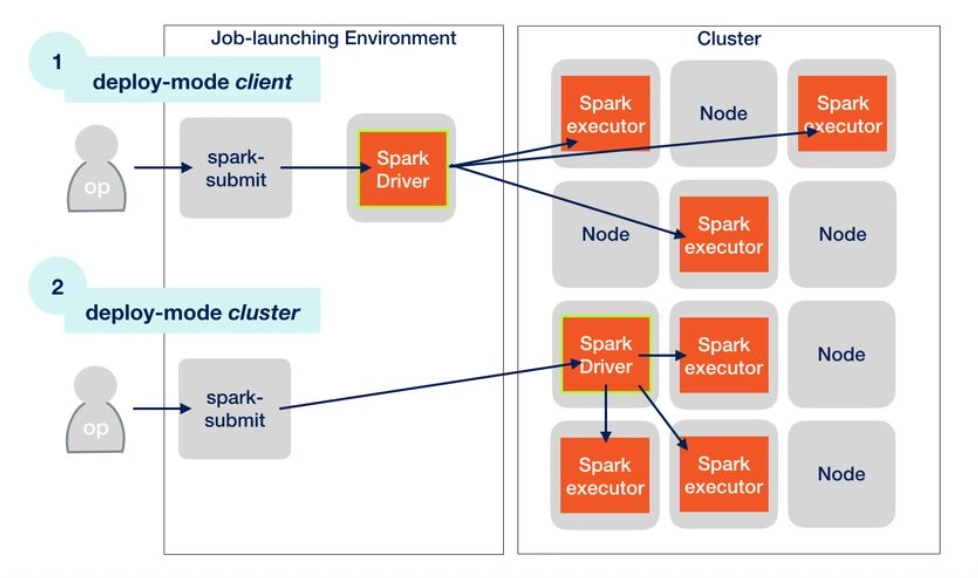


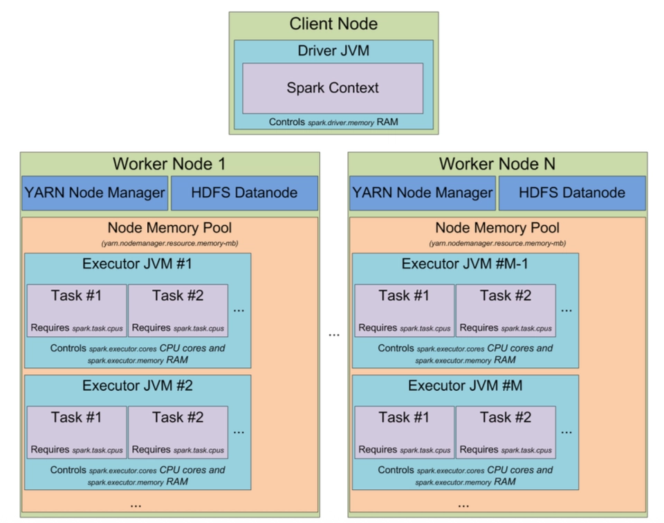

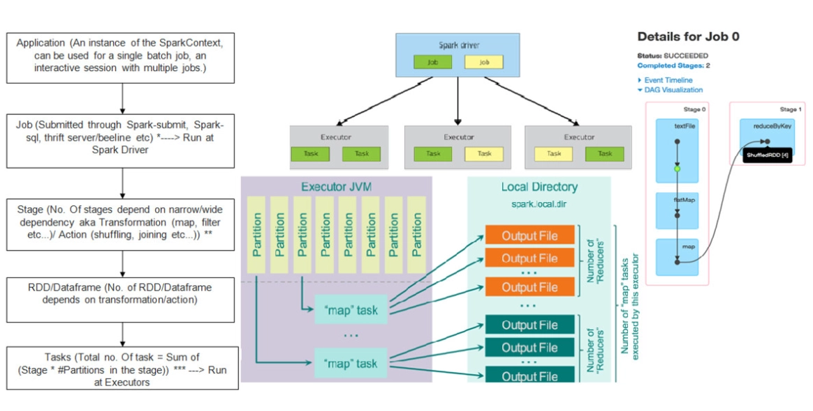

- 데이터를 Partition으로 쪼갬.
- 쪼개진 Partition에다가 map이 하나씩 붙어서 실행됨
- reduce를 하기 전에 데이터를 정렬함. map 결과를 정렬해놓는게 reduce 하기 빠름
- OutputFile은 local에 저장

<br>

### Client vs Cluster

**Client 모드**

- 클라이언트(또는 Edge Node)는 **클러스터의 모든 노드와 통신할 수 있어야 한다.** 따라서 클라이언트가 원격에 있거나 네트워크 연결이 불안정하면 통신 문제가 발생할 수 있다.
- 클라이언트 머신이 종료되거나 네트워크 연결이 끊기면 **Driver가 작업의 실행과 제어를 담당하기 때문에 작업(Job)이 실패한다.**
- 사용자가 Driver와 직접 상호작용할 수 있으므로 **대화형 애플리케이션, 디버깅, 개발 환경**에 적합하다.

**Cluster 모드**

- 애플리케이션은 **YARN, Mesos, Kubernetes**와 같은 클러스터 매니저에 제출된다. 클러스터 매니저는 **리소스를 할당하고 관리**하며, Spark Driver는 **Job, Stage, Task의 스케줄링**을 담당한다.
- 작업을 제출한 후에는 **클라이언트가 연결을 종료해도 클러스터 매니저가 작업을 계속 실행**한다.
- 장애에 더 강하고 안정성이 높기 때문에 **운영(Production) 환경이나 장시간 실행되는 작업(Long-running Tasks)**에 적합하다.

<br>

### Different Execution Modes across the cluster


- Spark Shell을 사용한다는 거 자체가 디버깅 하고, 개발하고 그런 작업을 하겠다는 의미

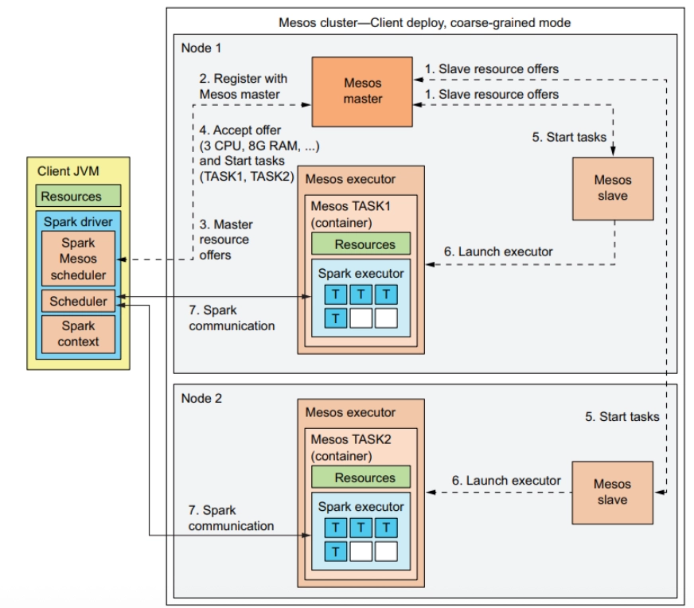

<br>

## Running Spark on Kubernetes


<br>

## In-memory Processing

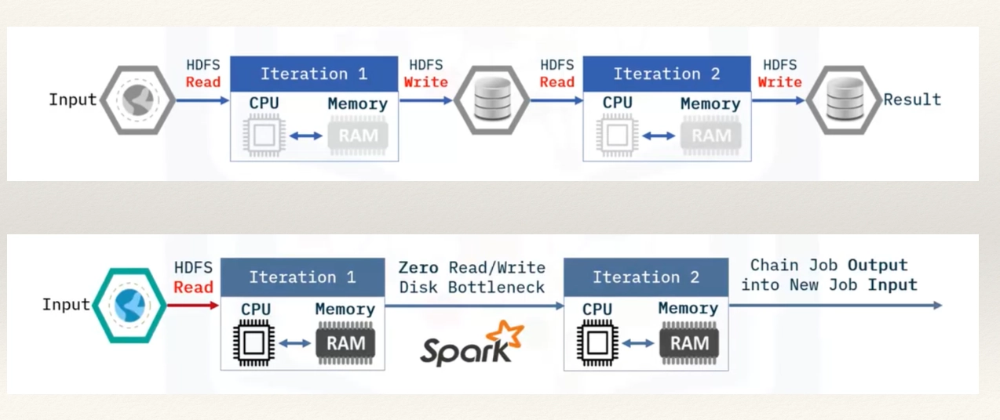

<br>

## spark-submit

```bash
# Run on a YARN cluster in cluster deploy mode

./bin/spark-submit \
--master yarn \
--deploy-mode cluster \
--executor-memory 20G \
--num-executors 50 \
examples/src/main/python/pi.py \
```

<br>

## Spark Standalone 모드

- Spark Standalone 모드를 설치하려면 **클러스터의 각 노드에 컴파일된 Spark를 설치**하면 된다.
- Spark는 각 릴리스에서 제공하는 **사전 빌드된(Pre-built) 버전**을 사용할 수도 있고, **직접 빌드(Build)**하여 사용할 수도 있다.

<br>

## YARN에서 Spark 실행

- YARN에서 Spark를 실행하려면 **YARN을 지원하도록 빌드된 Spark 바이너리 배포판(Binary Distribution)**이 필요하다.
- YARN은 Executor를 위한 컨테이너(Container)를 할당할 때 **Spark 바이너리를 Worker 노드에 자동으로 배포**한다.
- 따라서 Spark의 핵심 라이브러리와 의존성(Dependencies)이 작업(Job)과 함께 전송되므로, **작업 실행을 위해 각 Worker 노드에 Spark를 별도로 설치할 필요는 없다.**

### Spark 배포판의 두 가지 유형

- **with-hadoop Spark 배포판**
    - 특정 버전의 Apache Hadoop과 함께 사전 빌드된 Spark 배포판이다.
    - Hadoop 런타임(Runtime)이 내장되어 있으므로 **별도의 Hadoop 설치 없이** 사용할 수 있다.
- **no-hadoop Spark 배포판**
    - 사용자가 직접 제공하는 Hadoop 환경을 전제로 사전 빌드된 Spark 배포판이다.
    - Hadoop 런타임이 포함되어 있지 않아 배포판의 크기가 더 작다.
    - 대신 **별도의 Hadoop 설치 환경을 사용자가 직접 제공해야 한다.**

<br>

- **with-hadoop Spark 배포판**은 Hadoop 런타임이 이미 내장되어 있으므로, 기본적으로 작업(Job)을 YARN 클러스터에 제출할 때 **JAR 충돌(JAR Conflict)을 방지하기 위해 YARN의 Classpath를 Spark에 추가하지 않는다.**
- 이 동작을 변경하려면 `spark.yarn.populateHadoopClasspath=true` 설정을 사용하면 된다.
- **no-hadoop Spark 배포판**은 Hadoop 런타임이 포함되어 있지 않으므로, **Hadoop 런타임을 사용하기 위해 기본적으로 YARN의 Classpath를 Spark에 추가한다.**
- **with-hadoop Spark 배포판**을 사용하는 경우, 애플리케이션이 **클러스터에만 존재하는 특정 라이브러리**에 의존한다면 위 설정(`spark.yarn.populateHadoopClasspath=true`)을 통해 YARN의 Classpath를 사용할 수 있다.
- 하지만 이 과정에서 **JAR 충돌이 발생한다면**, 해당 설정을 비활성화하고 **필요한 라이브러리를 애플리케이션 JAR 파일에 직접 포함**해야 한다.

<br>

## Pandas API on Spark

```bash
import pyspark.pandas as ps
```

<br>

### 왜 pandas on Spark를 사용하는가?

- **pandas on Spark**는 pandas 사용자가 **더 빠르게 데이터를 처리하고**, 직접 최적화를 구현하는 대신 **Spark의 최적화 엔진**을 활용할 수 있는 좋은 대안이다.
- 데이터셋의 크기나 연산량이 **단일 머신의 메모리와 연산 성능을 초과하는 경우**에 특히 유용하다.
- pandas 사용자가 익숙한 **pandas 문법**을 그대로 사용할 수 있으므로 학습이 쉽다.
- 또한 pandas와 함께 사용하기에도 적합하다. **pandas on Spark의 대용량 데이터 처리 및 고성능 연산 기능**을 활용하여 데이터를 전처리한 후, 다른 기술과 호환되는 **pandas DataFrame**으로 변환하여 사용할 수 있다.

<br>

### regular pandas의 한계

- pandas는 **쿼리를 실행하기 전에 모든 데이터를 메모리에 로드해야 하므로** 처리 속도가 느려질 수 있다.
- 모든 데이터를 메모리에 적재해야 하기 때문에 **단일 머신의 메모리 용량보다 큰 데이터셋은 처리할 수 없다.**
- pandas의 연산은 **단일 CPU 코어에서 실행**되므로, 하나의 머신에서 사용 가능한 여러 코어를 충분히 활용하지 못한다.
- pandas의 연산은 **여러 머신으로 분산하여 확장(Scale-out)할 수 없다.**
- pandas에는 **쿼리 최적화(Query Optimizer)** 기능이 없으므로, 사용자가 직접 최적화를 구현해야 하며 그렇지 않으면 성능이 저하될 수 있다.

<br>

### pandas on Spark의 장점

- **단일 머신 환경에서도 더 빠른 쿼리 실행**이 가능하다. pandas on Spark는 사용 가능한 모든 CPU 코어를 활용하고, 쿼리를 병렬로 처리하며, 쿼리 최적화를 수행하기 때문이다.
- **클러스터 환경의 여러 머신으로 확장(Scale-out)**할 수 있어 대용량 빅데이터를 처리할 수 있다.
- **메모리 크기를 초과하는 대규모 데이터셋**에 대해서도 쿼리를 실행할 수 있다.
- pandas 사용자에게 익숙한 **pandas 문법**을 그대로 사용할 수 있어 학습과 사용이 쉽다.

<br>

### pandas on Spark의 한계

- **pandas on Spark는 pandas가 제공하는 모든 API를 지원하지 않는다.** 그 이유는 다음과 같다.
    - 일부 기능은 아직 pandas on Spark에 구현되지 않았다.
    - 일부 pandas 기능은 Spark의 **분산 병렬 실행 모델**과 맞지 않아 지원하기 어렵다.
- Spark는 DataFrame을 여러 개의 청크(Chunk)로 나누어 병렬 처리한다. 따라서 **일부 pandas 연산은 Spark의 분산 실행 방식에 적합하지 않아 동일하게 동작하지 않을 수 있다.**

<br>

### pandas on Spark와 일반 pandas 함께 사용하기

- **pandas on Spark와 pandas를 함께 사용하면 두 기술의 장점을 모두 활용할 수 있다.**
- 예를 들어, 대규모 데이터셋을 정제(Cleaning)하고 집계(Aggregation)하여 더 작은 데이터셋으로 만든 뒤, 이를 **scikit-learn 머신러닝 모델**의 입력으로 사용할 수 있다.
- 이 경우 **pandas on Spark**를 이용하여 데이터 정제와 집계를 수행하면 **빠른 쿼리 처리와 병렬 실행**의 장점을 활용할 수 있다.
- 데이터 처리가 완료되면 `to_pandas()` 메서드를 사용하여 **pandas DataFrame**으로 변환한 뒤, **scikit-learn**을 이용해 머신러닝 모델을 학습하거나 예측할 수 있다.
- 이러한 방식은 **최종 데이터셋의 크기가 pandas DataFrame에 저장할 수 있을 정도로 충분히 작아질 수 있는 경우**에 효과적으로 사용할 수 있다.